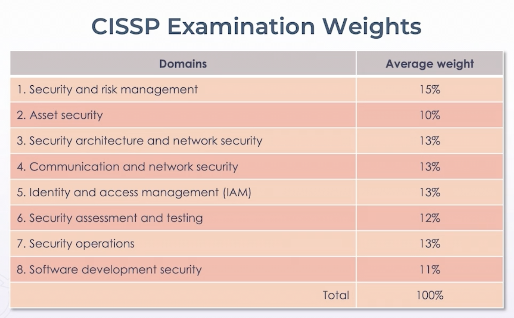

# ISC2 and CISSP Exam

## Code of Professional Ethics

* All ISC2 certification holders must commit to and support the code of ethics

* Intentional violation subject to peer review panel, which may result in revocation

* Members are obligated to follow ethics complaint procedure if observing another ISC2 member breach code

  * Failure to do so may be considered a breach pursuant to Canon IV

#### Code of Ethics Preamble

    The safety and welfare of society and the common good, duty to our principals, and to each other, requires that we adhere, and be seen to adhere, to the highest ethical standards of behavior.  

    Therefore, stric adherence to this Code is a condition of certification

#### Code of Ethics Canons

  1.  Protect society, the common good, necessary pubilc trust and confidence, and the infrastructure

  2.  Act honorably, honestly, responsibly, and legally

  3.  Provide dilligent and competent service to principals

  4.  Advance and protect the profession

## CISSP CAT & Linear Exam

* CAT - computerized adaptive testing 
  *  4 hour exam
  *  Adaptive questions and types - incl. drag & drop
  *  Passing is 700 of 1,000
  *  CAT is offered in English only    
 

* Linear Exam
  * Fixed-form 6 hour exam
  * Multiple choice & other types like drag & drop
  * Offered in other languges

#### Exam Weights

Domain and Weights:

Exam Weights

