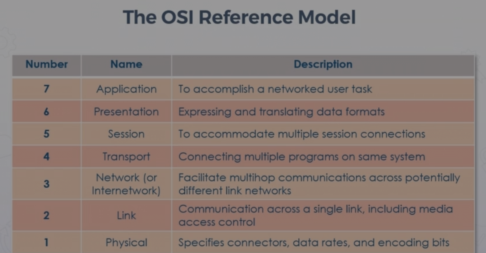
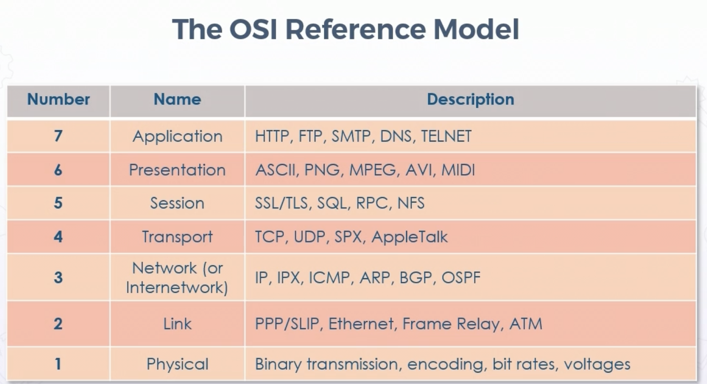
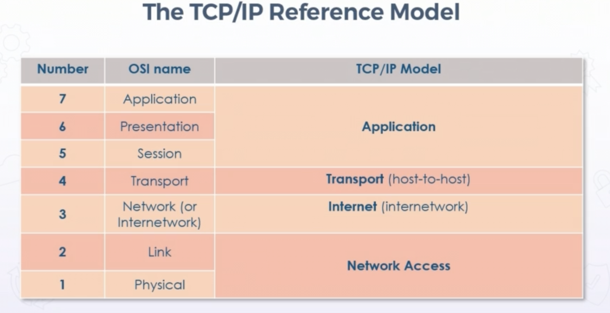

# Fundamental Concepts and Principals

## CIA Triad

### **Confidentiality**

*  Measures attackers ability to get unathorized data or access to information from app or system

*  People may be authentic, but not authorized to view 
  
*  Techniques, often cryptography to allow only approved users to view information

*  Confidential information can include:
    * passwords
    * crypto keys
    * PII
    * PHI
    * IP
    * other sensitive info

##### High-level confidentiality

* Uses hybrid encryption of symmetric & asym 

* Post-quantum and homomorphic crypto

* Compartmentalization 

### **Integrity**

* Measures attacker's ability to manipulate, change, or remove data at rest or in transit

     * Includes configurations  
 

* Involves implementation of controls allowing only authoirzed subjects have ability to modify information

* Might also include affirming identity of communicating peer (origin authentication)

* Breaches include injection or hijacking data in transit, modifyihng files, changing acls, dns & arp cache poisoning

##### High-level integrity

Advanced goals of the Clark-Wilson model:

* prevent unauthorized users from making modifications

* separation of duties to prevent authorized users from making improper modifications

* Ensure well-formed transactions; maintain internal and external consistency

### **Availability**

* measures attacker's ability to disrupt or prevent access to services or data 

* controls protect systems and services from spoofing, flooding, DDoS, poisonion, and other attacks that affect the ability to deliver data, content, and services

* software, hardware, & resources can be affected by availability attacks
    * bandwidth floods
    * cpu spiking
    * power consumption
 

##### High-level availability

* availability zones in cloud service providers
* regions spread throughout the world

### **DAD**

Opposite goals of CIA triad:

* Disclosure - unauthorized revealing of data and information

* Alteration - unathorized change of data or systems

* Destruction - rendering an entity inaccessible

### **Parkerian Hexad** 

Expanding beyond CIA Triad

Dr. Don Parker Parkerian Hexad

**Authenticity**

* Authenticity refers to the accuracy and identity of the origin of the entity/data

* often tied to identity

**Utility**

* Data not always valubale or useful in form

**Possession**

* referred to control of physical or logical asset
* breach of possession may not mean breach of confidentiality

##### High-level Authenticity

* origin auth is basic form of authentication

    * only provide degree of confidence that the correct password, phrase, or keys were used  
 

* add'l levels of authentication rely on trusted third parties (i.e. certs, digital signatures, multi-factors)

* kba - knowledged based authentication (i.e. have you ever lived at such and such an address)

### **Non-repudiation**

* Fifth Infosec pillar

* Inability to refuse participation in a digital transaction, contract, or communication 

* aka provides proof someone did something, signed something, etc

* level of assurance that owner of key pair used them, cannot convincingly deny use

* responsibility of creator or owner to protect key

* must notify when key is stolen, lost, or compromised

* typially accomplished w/digital certificates

### **OSI Reference Model**

  

"Please do not throw sausage pizza away"

Security is not natively built in

Physical - connectors, rates, encoding, etc

Link - L2, MAC

Network - L3 routing & forwarding (IPv4, IPv6)

Transport - ports

Session - accommodates multiple connections

Presentation - 

Application layer 

### **TCP/IP Reference Model**

