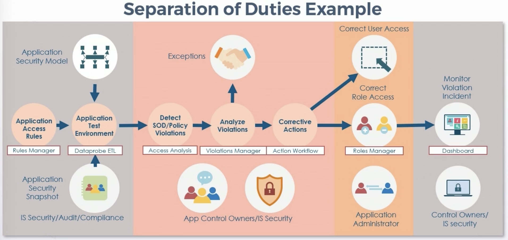
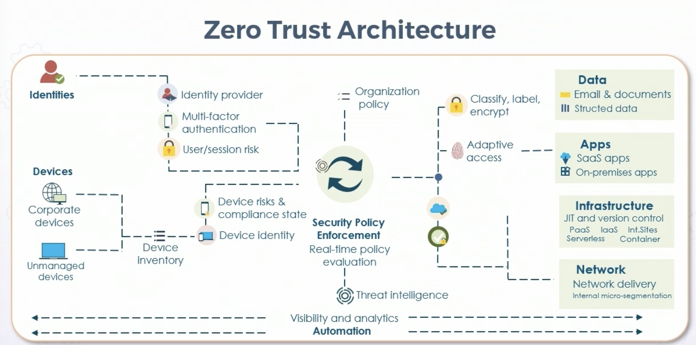
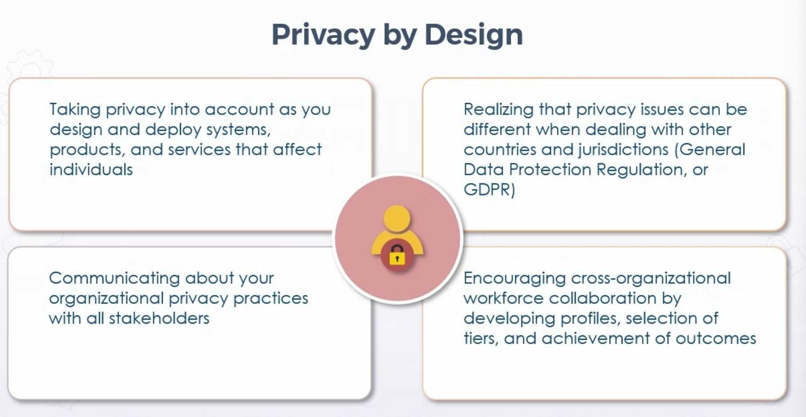
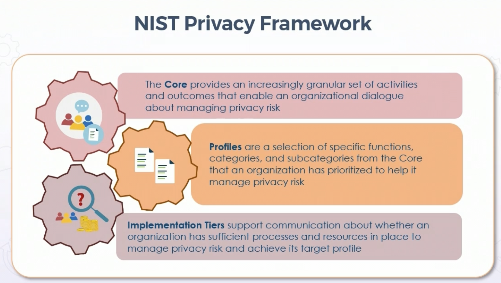

## Secure Design Principals

## **Least Privilege** 

* aspect of AAA & IAM

* subject has proper level or amount of permissions & rights to perform job role, nothing more

* granted to subject or via group

* should be built into all architectures

    * Mandatory access control - very strict

    * discressionary access control - like role based - more responsibility given to owner  
 

* any deviation should go through change control

* also referred to classification level or "need to know"

##### **NIST SP 800-53 - Least Privilege**

  * Authorize access to all security functions

  * Use non-privileged accounts when accessing non-security functions

    * Regular account vs admin account concept  
 
    
  * Prevent non-priv users from executing priv functions

  * Regular audit of execution of secure functions  
   

##### **ISO/IEC 27001 - Least Privilege**

  * Access to networks & network services

  * Management of privileged access rights

  * Use of privileged utility programs

  * Access contrl to source code

## **Defense in Depth (DiD)** 

* aka layered defense

* use of least privilege & DiD is function of "due care"

* systematically planned w/inward-out or outward-in approach

* applied to both physical security or technical controls

* common element of supply chain risk management (SCRM)

##### **Layered Security**

* end-to-end layered security w/several components

* can be single appliance w/multiple integrated engines

* physical or virtual

* applies to networks, applications, and physical facilities 

* trend of de-permiterization increases need to implement combination of cryptography, more secure protocols, hardened systems, and next-gen access control & endpoint protection

* builds on dmz boundary with casb and the like

## **Separation of Duties**

* aka segregation of duties

* often tied to compliance regulations 

* more than one entity required to complete a particular task

    * ex - separate data backup & restoration groups  
     

* SoD may involve dual operator principals - two or more subjects needed to modify or approve 

    * ex - two signatures or keys to perform certain actions  
 

* rotation of duties is a related principal

* reduce single point of failure for controls around 

    * ex - mandatory time off or vacations  
     

## **Keep it Simple** 

* Finding balance b/t security and usability

* Overly-complex design can lead to config errors (one of biggest vulns)

* Ex - overly complex password policy, people write them down 

## **Zero Trust**

* no implicit trust based on physical or network location

* no implicit trust to devices

* performs authentication & authorization as distinct tasks before session is established

* continual reevaluation 

* focus on protecting resources & not network segments or locations

* threat intel/modeling

## **Secure Defaults**

* Secure by design - Security development integreated into entire SDLC

* Secure by deployment - Deployed into environment where security is paramount consideration in network & system design

* Secure by default - native security of application w/o modifications or extra controls

* With secure defaults, defaults are most secure possible

* Often delivered using IaC (yaml, json, etc) 

    * single source of truth built on secure defaults 
 

* Not usually the most productive or user friendly deployment 

* Can be native to platform or policy based

* Other priniciples can be integrated - such as compartmentalization or proxy/mediated access

##### Examples:

* Azure Security Defaults

    * Requires MFA for all users
    
    * Require MFA for administrative actions
    
    * Block legacy auth protocols

    * Require MFA when necessary

    * Protect admin activities, such as admin portal

## **Fail Securely**

* Mode of sys termination functions to prevent loss of secure state on failure or failure detection

* ex. state machine, trusted state machine (SELinux), or TPM

* failure may cause damage to resource or entity, but does not create a vulnerability

* Implements secure defaults to deny access

* Falure undo changes/rollbacks to secure state

* Check return values/conditional code/filters for failure defaults

* Eusre that even with loss of availability, confidentiality and integrity remain

##### Example: Fail Open vs. Fail Closed Firewalls

**Fail open:**

  * Component failure or crash of feature (i.e. IPS), traffic is still permitted to prevent inconvenience/loss of productivity

  * Less secure option

**Fail closed:** 

  * On component failure or crash, traffic is not permitted, preventing attacker from launching exploit by forcing failure

  ## **Privacy by Design**

* Users do not always understand consequences of privacy when using apps, systems, products, or services

* Failure to design for privacy can have negative effect for individual and organization:

  * Brand image

  * Financials (increased borrowing)

  * Future growth prospects

* Secondary losses can exceed primary costs

##### NIST Privacy Framework

* Toolkit for reducing privacy risk through Enterprise Risk Management

* Voluntary toolkit dev w/industry stakeholders

* Assists orgs in managing privacy risk w/goal of indiviual privacy protection

##### 3 Elements of NIST Priv Framework

## **Trust but Verify**

* Not zero trust - but introduces stronger identification mechanisms

* Physical tokens w/OTPs or SMS OTP

    * SMS not recommended d/t exploits

