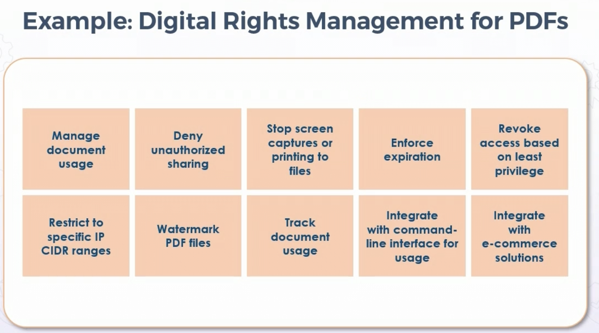
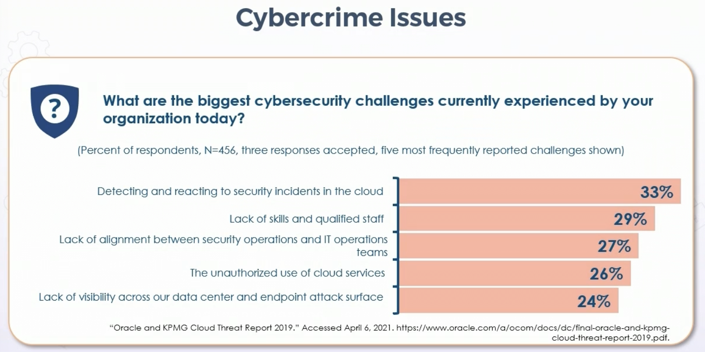
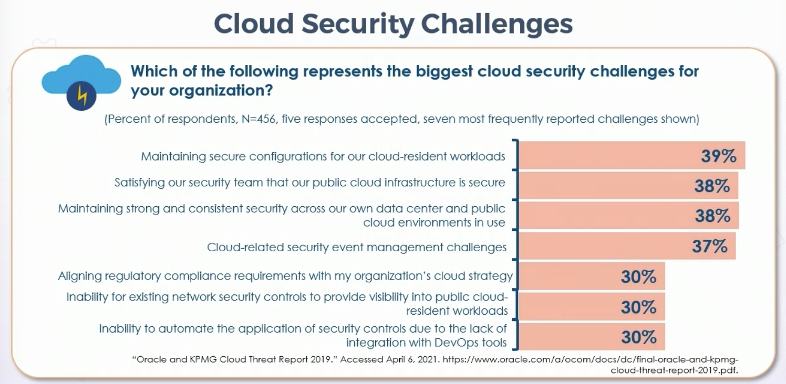
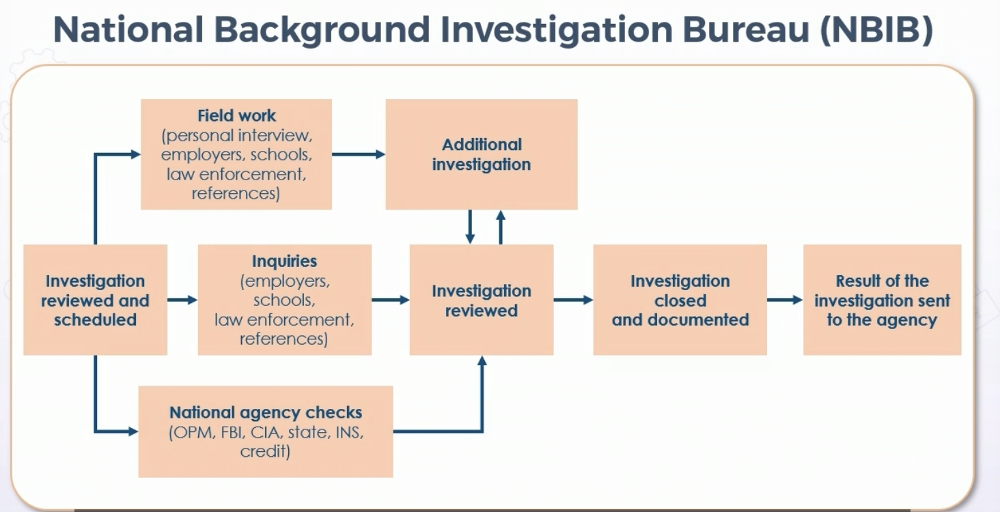

## Security Governance Principles

## **Overview** 

All security initatives begin at top as aspect of corporate governance. 

Security & Risk Management Objectives

## **Aligning Security with Business**

* Security must be aligned with an organization's strategy, value proposition, charters, goals, mission, & objectives

* Alignment must permeate through organization's processes, including governance, steering committee charters, corp initatives, etc

* Changes to org ops or activities must be taken into account - i.e. M&A, equipment lifecycle

* Must react to changes

    * Mergers & Acquisitions

    * Divestitures & de-mergers 

    * Legal ramifications - dark periods, etc.

    * Privacy issues, data sharing, interconnections, agreements

* Internal Influence Considerations

  * Functional - departmental based
   
  * Projectized - titles work horizontally across projects & programs

  * C-suite or C-team - hierarchy

  * Stakeholders & internal customers 

  * Management structure 

  * Internal Auditors - regular or ad-hoc

  * Key value propositions - do users understand role in creating secure enviornment

* External Influence Considerations

  * Stockholders, bondholders, partners
    
    * providing security for such

  * Regulators

  * Supply chain & vendors

  * Customers & clients

  * Lenders

  * Socio-political & economic factors

    * e.g. global pandemic

## **Organizational Roles, Responsibilities, and Processes**

* Understanding org RR&P must be understood for effective security

* Companies me be organized top-down, flat, outsourced, etc

* Directory services closely aligned to org duties & titles

* Roles & responsibilities often affect access control methods & sensitivity levels for mandatory access architectures 

* Responsibilities as driver of RBAC Methods

  * Often rely on org charts, roles, responsibilities, or locations

  * Role often based on essential objectives & architecture of enterprise, aligned with job title & responsibilities

  * Security must be aware of these roles & titles to architect access control

* Data & Asset Ownership

    * Owners often creators in Discretionary Access Control model

        * Owners determine classification level

        * Owners decide on handling & tagging/labels

        * Data processors usually have no ownership, just input/handling 

    * Data stewards - manage assets from business perspective

        * Often deal directly w/customers (internal and external)

        * Ensure complaince w/standards & controls, as well as quality

        * Think yacht stewards

    * Data Custodians - maintain assets from technical perspective

        * Often deal w/stakeholders & mgmt

        * Ensure confidentiality, integrity, authenticity, and availability of data & assets

    * Officers - such as CIO, CPO, CISO

        * Executive management - ultimate responsiblity for handling of data and assets

        * Data & asset owners often answer to officers directly, or to supervisor answering to executive

    * Security must know who owners, stewards, custodians, & officers in chain of data & assets

## **Due Care and Due Diligence**

* **Due Diligence** - act of performing thorough research before committing to plan of action

  * Proper information gathering, planning, testing, and strategizing before development, production, and deployment 

    * Background checks before hire or promotion

    * TPRM before MOU w/provider

    * Testing & evaluating solutions before contracting or using code
  
  * Understaning frameowrks required by law or is applicable under vendor due dilligence

    * ex. Fed agency adherence to security mandates when Controlled Unclassified Information (CUI) must reside in nonfederal system and organization

  * Supply chain security

* **Due Care** - Degree of attention a reasonable person takes for a particular entitity

  * ex. an enterprise mobility management inita

  * Level of judgement, attention, & activity one would engage in similar circumstances

  * Ongoing activities after due diligence has been performed

  * Examples of due care:
    
    * Necessary maintenance & patch management

    * Necessary precautions to ensure IP comms are provided CIA w/various controls

    * Using security principles like least priv, defense in depth, zero trust, sep of duties, etc for continual improvement & maturity

* Due diligence and due care are part of governance 

* Governance

  * Need for governance exists whenever group of people come together to accomplish an end or goal

  * Typically focuses on three attributes or characteristics:

    * Authority

    * Decision-making

    * Accountability

  * Focused on structure & processes for sound-decisions, accountability, management, and conduct at the top of an org

  * Flows down to sub-sets of governance

  * Directs how objectives are determined & achieved, how risk is controlled, and delivery of value improved

* Subset of global or corporate governance is security governance

  * Broadly defined as rules that protect assets & continuity of organization

  * Includes mission stmt, charters, declarations of value prop, policies, standards and procedures

  * Guies course & control of org security operations, initiatives, and activities

  * Security pracitioner strategy derived from effective security governance

* Security Governance Activities:

  * Creating & maintaining risk register/ledger

  * Publishing regulatory & compliance requirements

  * Tracking & recording compliance & remediation initiatives

  * Alignment of security strategy w/org goals (usually through written security policy)

  * Vital roles in risk assessment & management

  * Documenting stakeholder interactions & reporting related workflows

## **Compliance & Other Req's**

* **Compliance** = observing rule, policy, standard, specification, or law

* Regulatory compliance outlines goals to certify undersatanding of & actions to comply w/policies, relevant laws, and regulations

* Ex: companies providing products/svcs to federal govt must meet certain NIST directives

  * NIST SP 800-53 & 800-171 for fed supply chain

* Security governance is often responsible for publishing compliance & regulatory req's for org

  * Personnel compliance & remediation initiatives tracked & recorded in complaince db

  * Could be risk register or log

  * Often under CPO

  * Guidelines for using scanners for vuln mgmt

  * Register can also be used to help fulfill compliance req's

* Privacy Policy Requirements

  * Describe controls to protect IP, PII, PHI, and other sensitive data from leak, loss, & breach

  * Often needed to assure adherence to regs like Computer Fraud & Abuse Act, Electronic Communications Privacy Act, and Identity Theft & Assumption Deterrence Act in US

  * Avoidance of penalities from GDPR in EU

    * 1st violation 10m Euors or 2% of global annual turnover of previous year, whichever is higher

    * 2nd doubles

* Data Privacy 

  * Often mandated in reg or industry compliance standards such as HIPAA or PCI-DSS

    * Identify all data owners & processors

    * Discover incidents of remnance (artifacts or attributes that can remain on storage)

    * Implement collection limitiations 

    * Policy that allows PII and PHI scrubbing before sharing w/research institute or healthcare community cloud

    * Introduce DLP engines

* Intellectual Property

  * Shift to service-oriented enterprise has enlarged role of intangible assets & IP

  * Need for data protection & control increased

  * IP includes:
    
    * Copyrights and trademarks

    * Patents and formulas

    * Trade secrets and marketing campaigns

    * Digital rights & licenses

    * Crypto keys and passwords

* Privacy & Data Breach Consequences

  * Primary & Secnodary Losses:

    * Primary losses/costs includes:
      
      * Productivity

      * Response

      * Replacement of equip & personnel

    * Secondary can be more costly & include:

      * Fines & judgements 

      * Competitive advantage

      * Brand rep & goodwill

      * Higher lending costs

      * Loss of strategic partners & vendors

      * Loss of customers

* Digital Rights Management (DRM)

  * Access controlled tech that protects digital IP

  * Used by pubs, mfgrs, & IP Owners for content & device monitoring

  * Licensees attempt to balance rights of IP owners & users by protecting rights & profits for digital product mfgrs and retailers

  * Protects digital media like music, apps, software, films, tv, games, etc

  * NFTs

  

* Data Minimization for Privacy

  * Directive that states collected & processed data should not be kept unless it is critical to operations

  * Details determined early in lifecycle to support data privacy standards like GDPR

* Data Tokenization

  * Technique used to remove directly identifying elements from underlying data

  * Replaces raw data w/random tokens or pseudonyms

  * Often used w/structed data like CC and national identifying numbers (like US SSN)

  * Original data does not leave enterprise - even to cloud provider

  * Combined w/encryption for further defense in depth

* Security Control Frameworks

  * ISO/IEC 27000

    * Broad & flexible mature framework focused on infosec

    * Security equiv of ISO 9000 for mfg quality standards

  * NIST SP 800-53

    * Aligned to other ISO standards

    * Large businesses

  * COBIT 5

    * Control Objectives for Information & Related Technology

    * Created by Information Systems Audit & Control Association (ISACA)

  * Foreign: AGATE, IDABC, OBASHI

## **Legal & Regulatory Issues**

* Cyber threats in three main areas

  * Disruption

    * Ransomware to sieze control

  * Distortion

    * Mis-information w/bots and autmotated sources

  * Deterioration

    * Advances in smart tech = negative impact on ability to control information

* Emerging Cybercrime Issues

  * AI-enhanced adaptive malicious software

  * AI fuzzing to start, automate, and accelerate zero-days

  * ML trojans & backdoor

  * Hacking smart contracts based on buggy deployment

  * Cloud computing vulns

* Data Breaches

  * Most common attacks
    
    * Ransomeware

    * Malware variants

    * Phishing

    * DoS & DDoS

  * Most common internal threat is compromised privileged insider

  * More widespread d/t increased cloud computing & increased digital storage

  * Social media breaches = 56% in 1st half 2018

  * Cyberattacks are among top five risk to global stability

* Licensing issues

  * Licenses & agreements must be understood

    * Contractual license agreement 
    
      * written & digitally-signed agreements

    * Shrink-wrap license agreements on packaging

    * Click-through license agreements

      * During install

    * Cloud service provider license agreements

* Import & Export Issues

  * In US, ITAR began during cold war

  * ITAR governs export of items designated as military & defense items

  * Export Administration Regulations (EAR) govern wider set of items

  * Supply chain security critical in import/export activities

  * Cybersecurity trade conflict emerging issues

  * Encryption controls are key issue

    * US Dept of Commerce Bureau of Industry & Security sets regs on export of encryption outside US

* Trans-border Data & Information Flow

  * Considerations to flow of data, information, and goods across international border

  * Considerations to legal and regulatory implications

    * Rapid change based on geo-political factors

  * Cultural norms, customs, sensitivities, and behaviors - ex. European vs Asian customs

  * Regional policies & procedures - countires under differing regulations & mandates

    * Frameworks like AGATE, IDABC, OBASHI, ITIL, ISO, TOGAF

  * Cryptographic export standards

  * Cloud computing muddies the waters

## **Requirements for Investigations**

* Conducting Investigations

  * Employment candidate screening processes

  * Promotion to higher sensitivity levels

  * Periodic review as part of employment policy

  * Compliance and privacy policy req's

  * Incident response and forensic investigations

* National Background Investigation Bureau (NBIB)

  * Used to be OPM

  

