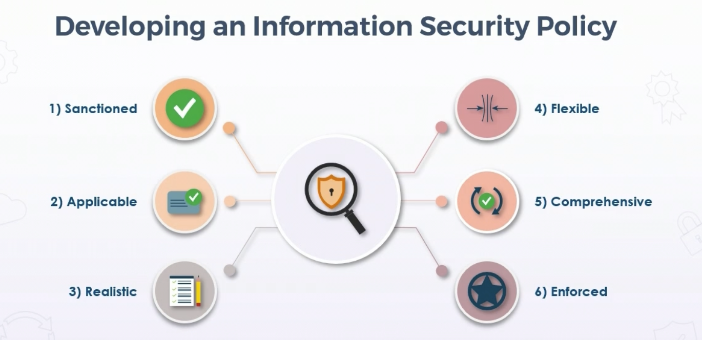
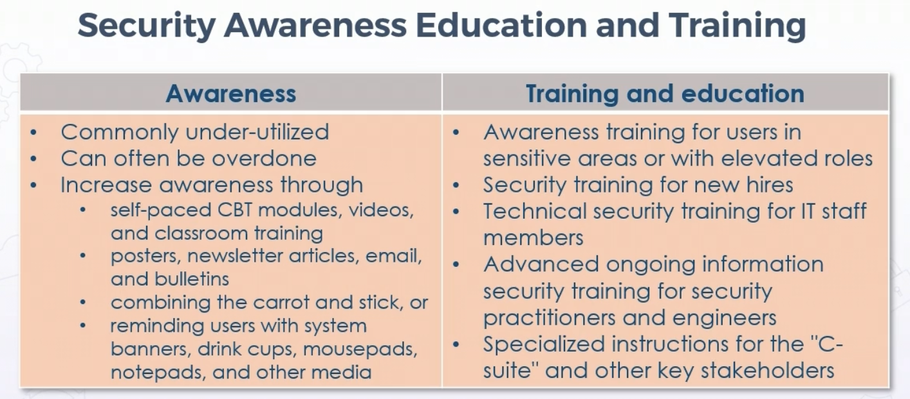

# Security Policy

## **Overview** 

* Written & published security policy - critical aspect of security governance for all size orgs

## **Policy Development and Implementation**

* (Security) Policies establish general working framekwork & guiding direction to take in the future

* Function of policy is to:
  
  * Classify guiding principles

  * Direct behavior

  * Offer stakeholder guidance 
  
  * Security control implementation roadmap

* Information security policy is directive that outlines enterprise's plan for protecting data, applications, and systems

  * In other words, how it achieves confidentiality, integrity, availability, authenticitiy, possession, control, and utility

* Helps ensure compliance w/legal and reg requirements, & preserve environment that sustains security principles

* High-level overview pubs, guide way in which various controls & initatives are implemented

## **Developming an Information Security Policy**

* Six elements to an information security policy

  * **Sanctioned**
  
    * Must have support of exec management

    * Visible particpation, ongoing comms, & campaigining for ROI

  * **Applicable**
  
    * Supports guiding principles & goals of org
    
    * Relevant to those who must comply
    
  * **Realistic**
     
     * Can be successfully implemented?
     
     * Reflect reality of environment to which they are deployed

     * Only ask for what is attainable

     * Set up for success, not failure

  * **Flexible**

    * Accommodates change & adapts when necessary

    * Recognition that security is not static, not a point-in-time 

    * Security is an ongoing, continual improvement process

  * **Comprehensive**

    * Scope must include relevant BUs, stakeholders, entities

      * Inclusive of all relevancies

      * Accounts for org objectives, applicable laws, regs, cultural norms, vendors suppliers, customers, business partners 

      * Considers enviornmental & socio-political impacts, shareholders

  * **Enforced**

    * Needs to be statutory

    * Admin, physical, or technical controls in place have sanctions behind them for someone not adhering to policy 

    

* Polices can & will change based on new technologies

  * Examples: 
  
    * IoT hardware authentication policies

    * UBA policies

    * AI/ML policies

    * VR/AR policies

    * Cloud provider interactions

    * SaaS/PaaS/etc

## **Standards, Guidelines, and Procedures**

### Standards

* Standards allow IT staff to be consistent & systematic

* Standards specify use of specific tech in uniform ways

* Standards provide consistency - unreasonable to support multiple different versions of hardware & software if not necessary

* Usually mandatory, improve efficiency & keep simplicity

### Guidelines

* Guidelines provide list of suggestions on ways to do things more effectively

* More flexible than standards, usually not mandatory

* Define how standards are developed or guarantee some level of adherence to general security policies

* Some best guidelines available are in "best practice" repos

  * NIST Computer Security Resource Center

  * NSA Security Config Guides

  * CIS Top 20

### Procedures (Processes & Practices)

* Usually required, but at lowest level of policy chain

* Longer & more detalied than standards & guidelines

* Include implementation details, step by step instructions & graphics

* Help large orgs achieve consistency of deployment needed for secure environments at scale

* IaC w/YAML or JSON, for example, using Terraform or AWS CloudFormation

### Standard Operating Procedures (SOPs)

* Often used in place of procedures

* Step by step instructions for routine tasks

* Greatly improve:
  
  * Efficiency

  * Quality

  * Performance

  * Communication

  * Compliance w/regs

* Best deployed w/automation & orchestration tools

* SOP Considerations:

  * Describe purpose & limits of procedures

  * Contain all steps needed to complete process

  * Clarity on concepts and terms

  * Consider health & safety issues

  * List location of necessary supplemental resources

### Acceptable Use Policy (AUP)

* Often considered one of the most important sections of written security policy

* Identifies expected resource usage by employees

* Defines rules of behavior/codes of conduct, eg:

  * Using acceptable language

  * Avoiding illegal activities

  * Avoid disturbing or disrupting other systems

  * Privacy of personal and confidential information - PHI, PII, IP, trade secrets, etc 

* Categories in AUPs include:

  * Mobility & Wireless

  * OS & Software

    * Allow/disallow certain software/features

  * Personal cloud storage usage

  * Removable media & usage of same

  * Email & browsing

  * File sharing, p2p, etc

* Managerial/Administrative AUP Controls

  * Change management processes

  * Least privilege policy

  * Mandatory vacations

  * Separation/Rotation of duties

  * Clean desk policies

  * Social media usage policies

* AUP Enforcement

  * Levels of enforcement, from verbal reprimand/warning, to official written warning, temp suspension w or w/o pay, or Termination

  * Civil or legal action, restitution, reimbursement, etc

## **Employment Candidate Screening & Hiring**

### Screening and Hiring

* Security policy steering committees must work closely w/HR and Legal to determine best practices

* NDA or confidentiality at interview is not uncommon

* Employment contract after offer acceptance

* New employees should sign off on all security policies as well as AUP

### Employment Candidate Activities

* Working with headhunters or online job sites

* Security practitioners may be involved w/confirming some or all references

* May assist with approving education, certs, and experience 

* Additional fact-checks on resumes

* Background & credit checks

* All activities must adhere to compliance & privacy requirements

* Conducting technical interviews

## **Employment Agreements and Onboarding**

### Onboarding

* Provide assets, knowledge, skills, & behavoirs needed for role on team

  * Videos, CBT, printed material, lectures, formal & informal meetings, mentors

* Intro to teams, SOPs
  
  * Clearly define role & responsbilities

* Provision devices & equipment

  * Corp, personal

* Deliver Security Awareness & AUP 

* Additional HR activities

  * Removes ambiguity

### Non-Disclsure Agreements (NDAs)

* Includes additional confidentiality agreements signed by a new hire

* NDA is legal contract b/t parties

  * Confidential relationship, often strictly enforced

  * Severe consequences for violation

  * B2B, or B2Empoyee

* Identifies confidential information shared between parties and party BUs, but not externally

  * Can cover IP, trade secrets, tech, campagins, ideas, new processes, new products, and services

  * Certain types of secret/top secret info

  * Restricts sharing of that info with other entities

* Common during interviews, and added-to during onboarding for info that is pertinent to performance of job, but not relevant during interviews

### Automating Onboarding

* Self-service onboarding of personal devices to access company resources

* Supplicant automatically provisioned for user & installed using profile to connect to company resources 

* Often 802.1X NAC using EAP-TLS, P-EAP, EAP-Fast

* Can be automated w/SaaS and CASB

* Offboarding is reverse, more security vulnerability than onboarding 

## **Employment Termination & Transfer Best Practices**

### Offboarding Best Practices

* Termination and transfer depend on circumstances

  * Promotion/demotion, transfer, immediate vs resignation

* Document all procedures for revoking access before termination

* Monitor and audit closely in interim b/t resignation and effective date

* If possible, terminate face to face, w/witness

* Meet all regulatory (WARN and SOX) requirements

* Disable/delete accounts, revoke certs & digital signatures, CRL/OSCP updated

* All physical and IP returned

* Modify or update corp controlled social media

* Add to list of potential threat agents in threat register or log

* Follow-up interview if possible

### Release & Exit Interviews

* Try to identify factors leading to departure

  * How can org improve to keep employees

  * Discover unknown security vulns or issues w/other employees

* Remind exiting/transferring employee of agreements & responsiblities

  * Review NDAs, confidentiality agreements, etc

  * Remind what info they can and cannot discuss with others

* Adhere to defined offboarding security policies & procedures

  * Collect all corp assets and property

## **Vendors, Consultants, and Contractors**

### Service Level Agreements (SLAs)

* Third party contracts can be internal or internal

* External SLAs are common

* Define precise responsibilities of service provider & customer expectations

* Clarify support system response to problems or outages for an agreed level of service

* Internal between BUs or departments, often referred to as OLA

* Should be used with new 3rd party vendors or cloud providers (SaaS, IaaS, PaaS) for 24 hour support

* Security concerns such as IAM, cryptographic standards for data in transit or at rest, data loss, loss of IP, PHI, PII, etc

* Helps define achievement of confidentiality, integrity, availability, and non-repudation

### Organizational Level Agreemets (OLAs)

* Documents pertinent info for regulating relationship between internal service recipients and internal IT area (service provider)

* Key difference b/t SLA and OLA:

  * what service provider promises customer (SLA) vs what functional IT groups promise each other (OLA)

* OLA often mirrors SLA with specific differences based on the enterprise

### Memorandum of Understanding (MOU)

* Also called Memorandum of Agreement (MOA)

* Also called "letter of intent"

* Formal MOU/MOA often preceeds more formal agreement or contract

* Defines common courses of action and high-level roles & responsibilities in management of cross-domain connection

* Often committment to move forward with a provider

* Usually terminates customer's providers search so time & resources can be dedicated to formal contract process

### Reciprocal Agreements (RA)

* Between two orgs w/similar infra and tech

* Difficult to legally enforce

* Common goal is to provide recovery to other site in case of disaster or long outage

* More quid-pro-quo agreement to share resources in emergency or to achieve a common objective

  * E.g. two departments storing one another's backups on their systems

  * E.g. disaster planning, allowing one another to use facilities, resources, sites, etc after disaster

### Interoperability Agreement (IA)

* Agreement b/t two or more entities for collab and data exchange

* Often used by sister companies under holding group

* Binding agreements for sharing info systems, telecomms, software, and data

* Not an RA

* Eg. Information Security Agreement for AWS Direct Connect or Azure ExpressRoute

### Third-Party Risk Factors

* Vendor & supplier reliability

* Safety & security of supply chain

* Business partner privacy vulnerabilities

* EOL products and services

* End of service posture

## **Security Awareness, Education, and Training**

 

* Awareness can be under or over-done

* Combine carrot and stick - rewards and backing of enforcement

* Buy-in

* Training & education is more formal

* Understanding of org mission, charter, and vision

* Applicable policies & procedures

  * Password & badge policy (MFA)

  * Tailgating/piggybacking

  * Clean desk

  * Anti-phishing

  * Social engineering

  * DLP

  * Governance, regs, mandates

### Role-based Security Training

* General endpoint users

* Data/system owners

* Data/system custodians & stewards

  * Custodian technical training

  * Steward more business training

* Admin & priviledged users

* Executive users - HVT

  * Exec management

  * C-Suite

  * Boards

### Example Awareness Program Development

* Identify scope, goals, target audience

* Motivate & get buy-in from mgmt & employees

* Identify optimal & affordable training platforms - webinars, self-paced CBT, etc

* Administer & Maintain 

* Evaluate and continual improvement

