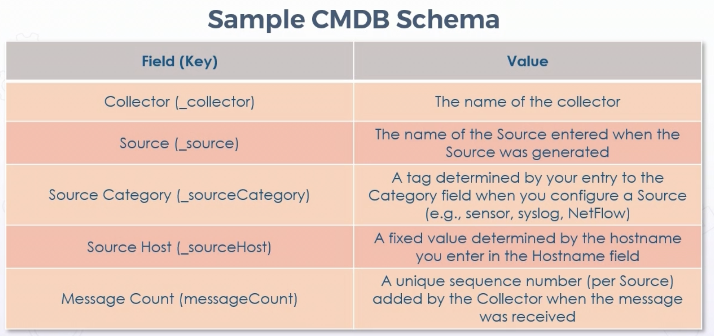
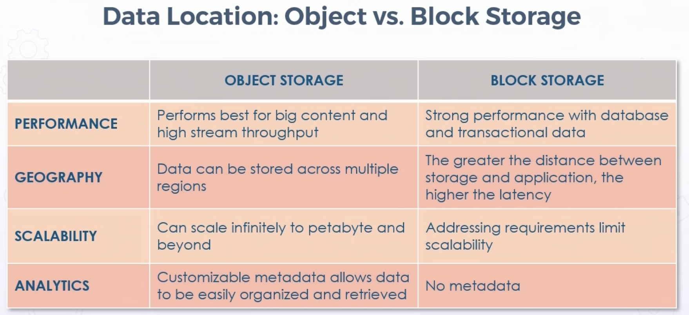
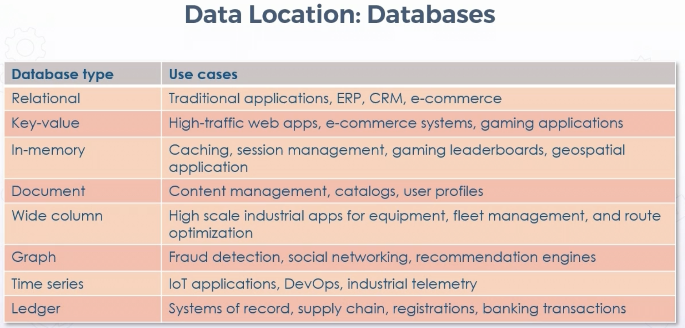

# Asset Classification & Lifecycle

## **Overview** 

Practitioners need understanding of types & valuation of assets, both tangible and intangible.

Module covers various aspects of lifecycle:

* Data and asset states & classification

* Information & asset handling requirements

* Data roles

* Asset sanitation and destruction

## **Data States**

States of data affect risk managemement & assessment, data loss prevention, usage of various crypto, and various controls

* Data at rest

  * On hard disks, memory cards, in data centers, archives

  * Removable media and external drives

  * Cloud storage & arcives - Azure Blobs, S3 Buckets, etc

* Data in transit (aka data in motion)

  * Data sent on network, LAN/WAN, wireless

* Data in use (volatile data)

  * Data in use in CPU registers

  * Data in memory

  * Volatile storage

  * Redis & Memecached clusters, etc

### Protecting Data at Rest

* Conventional perimeter defenses

  * Hardware/Software firewalls

  * IPS & AV, etc

* Defense-in-depth w/MFA

* Secure principals:

  * Dual operator

  * Separation of duties

* Volume, disk, & file encryption

  * Full-disk encryption (FED)

  * Self-encrypting drives (SED)

* Partitioning storage 

  * Hardware Security Modules (HSM)

  * Secure enclave on Mobile

### Protecting Data in Motion

* Encapsulating methods

  * IP in IP

* Dedicated channels (leased lines, evpl, dedicated fiber)

* Crypto systems

  * SSL/TLS

* IPSEC

* WPA2, WPA3 w/mgmt frame protection

* 802.1X NAC

* 802.11AE MACsec (layer 2 security)

### Protecting Data in Use

* Least mature protection systems

* Overhead d/t encryption/decryption

* Cost & difficulty of implementation

* Newer methods, s/a homomorphic encryption

  * Conduct calc on encrypted data w/o decryption

* Trusted computing systems (i.e. SELinux)

* ML/AI algos

## **Data & Asset Classification**

Have to know what you have to know what to protect

* Using models that have sensitivity labels & classification

* Using well-established tagging & labeling schema

  * Optimally mapping to CMBD

* In this area, NoSQL document-style databases are superior to relational

* Assess, classify, & label:

  * Facilities, equipment, physical assets

  * Data & Information assets

  * HR/People assets

  * Intangible & intellectual property

* Assets can exist on-prem, cloud, or other sites (like DR)

### Configuration Management Database (CMDB)

* Not typical data warehouse

* Critical role in ITSM & ITAM initiatives

* Assist aligning w/business needs by providing current & accurate data

  * Change & patch management

  * Incident & problem management

  * Availability management 

  * Release & deployment management

* Practices offer required data about assets & config

* Interaction w/other assets, helping with:

  * Problem resolution

  * Incident response

  * Network component deployment

  * Strategy formulation

  * Budgetary forecasting

  * Decision making

## **Information & Asset Handling Requirements**

* Labeling concerns classification & priority of data, systems, & assets

* Determines level of protection

* Determines how asset should be handled

* Handling controls who can access assets & what actions they can take

* Handling based on labeling & classification

### Choosing Classification Level

* Beyond data, common attributes for classification include:

  * Value

    * Monetary and value to business 

    * Both present AND future/revenue potential

  * Architecture

    * Subjects & objects restricted by mandatory access control model

  * Age

    * Value of data lowers over time - sometimes leads to automatic declassification

    * Physical asset depreciation

  * Useful life

    * Information made obsolute it can often be declassified or devalued

    * New version or generation of object, previous version no longer as value

  * Personal assocation

    * Data involves PII or PHI

### Sample CMDB Schemas

* Develop a well-established, consistent, comprehensive key-value pair schema

## **Provision Resources Securely**

### Asset Management

* Automated - bottom line (for exam)

* Tracking physical & logical assets = improved risk management & recovery for business continuity

  * Location

  * Modification

  * Disposition

* Asset manager main task is to supervise all activities related to asset management

  * Including software used for tracking

  * May be titled, or an additional duty of sysadmin, etc

* Digital asset manager is growing role

* Automation & orchestration is vital for scale

### Asset Inventory Control

* Just-in-Time is prevalent

  * Reduces inventory on shelf costs

  * Can lead to shortages

* Managing inventory controls budget & security

  * More efficient management of operating capital

  * Assess type of inventory

  * Determine quantity needed on-hand

  * Track market trends of competitors

  * Identify minimum levels

* Best practices for fixed asset inventory software:

  * Realize scope of project

  * Assign responsibility for asset management

  * Personnel understand basic fixed asset procedures

    * Allows manual work in disaster scenario

  * Utilize software/automated software

  * Look for tech trends - i.e. Inventory SaaS

  * Clear out ghost/shadow IT

## **Data Roles**

* Roles can apply to data as well as assets

* Owner

  * Owns information in delegated access control models

  * Typically the creator, discretion to assign rights

  * Determines tagging & classification level

* Steward

  * Manages data & metadata from business perspective

  * Usually ensure compliance (standards/controls) & data quality

  * More focused on administrative controls

* Custodian

  * Keeper of information from techincal perspecitive

  * Focused on technical controls rather than administrative

  * Ensures CIA is maintained

* Processor

  * No owner, stewardship, or custodial relationship other than processing

  * Works with raw data, data entry

  * Batch processing

* Officer

  * CIO, CPO, CTO, etc

  * Ultimate responsibility for data

## **Data Lifecycle Management**

### Six phases of data lifecycle per CISSP objectives

* Collection

  * Data capture

  * Three key methods typical for data capture:

    * Acquisition: consumption of readily available data produced by an outside entity

    * Entry: generation of new data values for organization by humans or devices that produce data for the enterprise (data input)

    * Reception: capture of data generated by devices, ex:

      * Logs

      * Netflow

      * CASB

      * Cloudwatch

      * SCADA, ICS, IoT

  * Uncollected data cannot be analyzed, used, matched, or utlized for data-driven business decisions

  * Data is needed for mature lifecycle

  * Only data necessary for needs should be collected, ideally abstracted at presentation

  * Art. 25 of GDPR mandates protection of data by design & default

  * Integrate data protection at beginning & throughout lifecycle

* Location

  **Object vs block storage**

    

  * Streaming vs transactional

  * Regionality vs latency

  * Scalability vs limited

  * Metadata vs structure

  * API/URL vs filesystem

  **Types of DBs**

    

* Maintenance

  * Initiated once data collected & located

  * Involves offering data to points where usage & synthesis happen

  * Some models have this as the transition from raw to useful information

  * About processing w/o yet deriving value for enterprise

  * Processes such as movement, integration, clensing, dedupe, augmentation, and ETL

  * Goal of a number of data management activiites 

    * Data governance challenging in this area

* Remanence

  * Data, metadata, & artifacts leftover after software deletion process

  * Known residual risk during lifecycle

  * Physical destruction is always best choice

    * Clearing - wiping/overwriting, may be recoverable

    * Purging - more enduring/stronger - sanitizing or degausing - not considered recoverable

    * Destruction - shredding, pulverising, burning, encryption 

* Retention

  * Length of storage can be just as important as what is being stored

  * Defines what, how, how long, and how it is disposed of

  * Often involves different locations along data lifecycle

    * Hot vs cold storage, on-prem vs cloud archive, etc

  * Audits help ensure data is removed when no longer needed

  * Automated disk or storage lifecycle tools

    * Storage gateway (hardware or virtual)

* Destruction/Disposition

## **Asset Retention**

### Asset disposal

* In disposal process/phase, plans developed for discarding system info, hardware, and software, and making the transition to new systems

* Information, hardware, & software may be moved, archived, discarded, or destroyed

* If done improperly, can result in unauthorized disclosure

* Archiving must consider need and methods for retrieval

* Ensure orderly termination of system & data, preserving vital information if need to reactivate parts or in whole becomes neecessary 

* Emphasis given to proper preservation of data for compliance with regulations, policies, and future access or retrieval

* Removal of information from storage medium should be done IAW organizational security requirements

### Destruction and Sanitization

Types of data destruction/sanitization include:

  * Paper: burning, shredding, pulping, pulverizing

  * Microfilm/fiche, laser discs, imaging apps: pulverizing

  * Data: degausing

  * Shredding tapes & disks

  * Purging - clearing everything off media

  * Wiping - overwrite with 0 & 1's

    * DOD 5220.22-M - Sanitizing method, industry standard in US

  * Encrypting 

Example: maintaining documentation of destruction of PHI:

  * Date of destruction

  * Method

  * Description w/o PII/PHI

  * Inclusive dates

  * Statement that they were destroyed w/in course of normal business

  * Signatures of those supervising & witnessing

  
