# Risk Management

## **Threat & Vulnerability Identification**

### Inherent Risk

* Assessed level of raw or untreated risk

* Natural level of risk inherent w/o reduction or mitigation

* Current risk level given existing controls (which may be incomplete or less than ideal) - rather than lack/absense of any controls

### Residual Risk

* Risk or danger associated w/action after natural/inherent risks reduced with risk controls

* General formula to calculate:

  >>> __residual risk = (inherent risk) - (impact of risk controls)__

* Impact of risk controls = +difficulty or +resistance against threat actors/agents

### Risk Treatment/Handling/Appetite

* Risk avoidance - stopping or rejecting activity that introduces the risk

* Risk transference/sharing - trasnfering risk to another, ex. insurance or cloud provider

* Reduction/Mitigation - reduced to acceptable level by implementing controls

    * Should cost less than the income/value of the activity

* Risk acceptance - tolerate potential loss w/no countermeasures or controls

### Assessing Vulnerability

* Defining vulnerability
    
    * Vulnerability should be quantified as much as possible - i.e. % of vulnerability

    * Likelihood that threat will resut in loss (frequency & magnitude)

    * Can be a derived value from threat capability combined w/resistance of existing security controls

* Asset assessment & labeling

    * Client & server OS

    * Posture of patches, updates, security fixes

    * Baseline of browsers & endpoints

    * Methods of access - wired/wifi, vpn, and remote 

    * Control types & categories in organization

    * Access control methodologies

* Indicators of Compromise (IoC)

    * Network/host based observables

    * Forensic artifiacts 

    * Measurable event or stateful property

    * Registry entries, compressed/encrypted files on disk and memory, etc

* Vulnerability Information Gathering

    * Various logs (system, app, firewall, etc)

    * SNMP traps

    * Netflow

    * SIEM 

    * Next-gen IPS

    * Cloud-based visibility tools

    * ML/AI data analysis

* Vulnerability Databases

    * Typically categorizes/defines vuln and varients w/timeline and coding

    * Assesses qualitative scale of affected

    * May provide mitigations, workarounds, updates, etc

    * Most known

        * Common Vulnerabilities and Exposures (CVE)

            * from MITRE
            
            * used by national vuln database (NVD)

        * Common Vulnerability Scoring System (CVSS)

            * Open standard for severity weights

            * Uniform & consistent 1-10 scoring

        * NIST NVD

        * ISS X-Force

        * Symantec/SecurityFocus

        * @Risk from SANS.org

* Vulnerability Scanning

    * Web App most common (burp & zap)

    * Scan web apps for common vulns

        * CSS/CSRF

        * SQL injection

        * Path traversal

        * Insecure config

* Dark Web/Darknet

    * Special tools/software/configs

    * Not indexed

    * p2p

    * Tor, freenet, I2P, Riffle

* OSINT

* Other sources:

    * CISA's AIS

    * STIX (MITRE) & TAXII

    * Predictive analysis & threat map prediciions

## **Risk Assessment & Analysis**

### Risk Assessment Document

* Records processes to ID probable threats & propose responses

* Document assets at risk (people, bldgs, IT, utilities, machinery, raw & finished goods)

### Risk Assessment Document Inputs

* Hazard Identification

* Vulnerability Assessment

* Impact Analysis

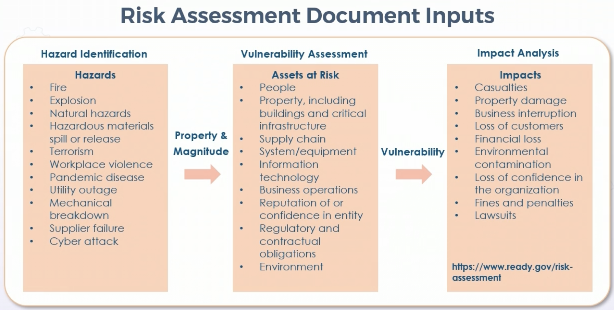

* Risk & Threat Matrix

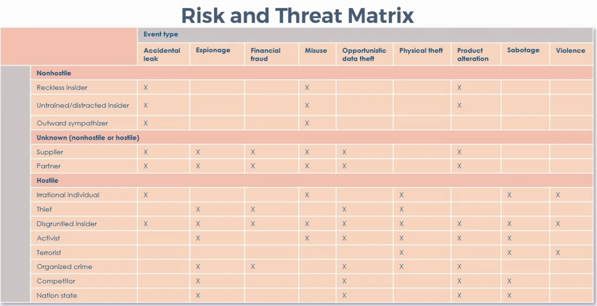

* Classic Qualitative Analysis

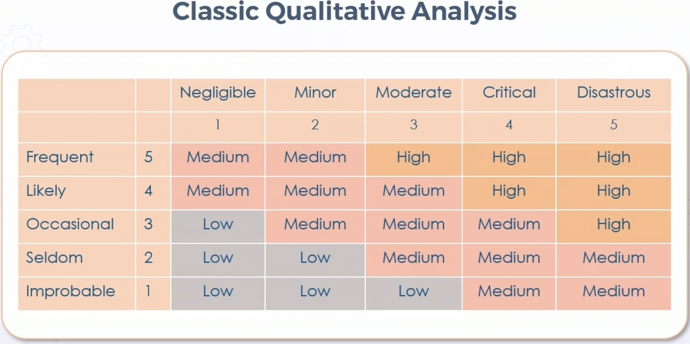

* Just like 2LT Mom used to make

* Classic semi-quantitative analysis

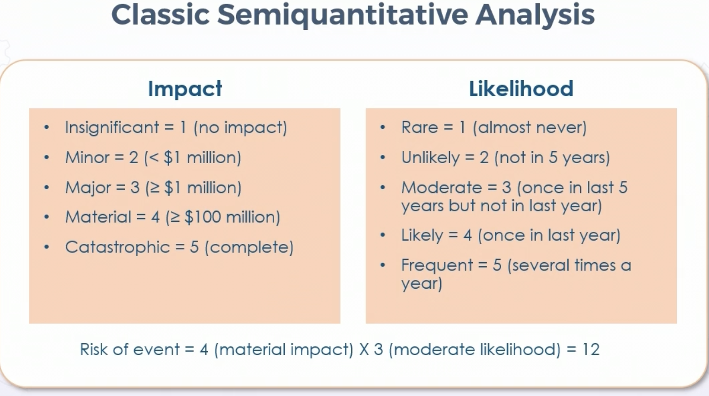

* Classic Quantitative Analysis

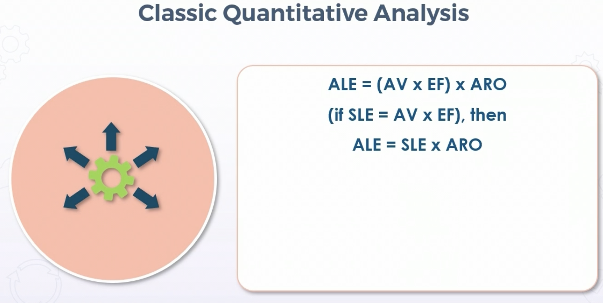

 * ALE: Annualized Loss Expectancy

 * AV: Asset Value

 * EF: Exposure Factor - Percent of financial value loss from single incident

 * SLE: Single Loss Expectancy

 * ARO: Annualized Rate of Occurrence

* Factor Analysis of Information Risk (FAIR) Method

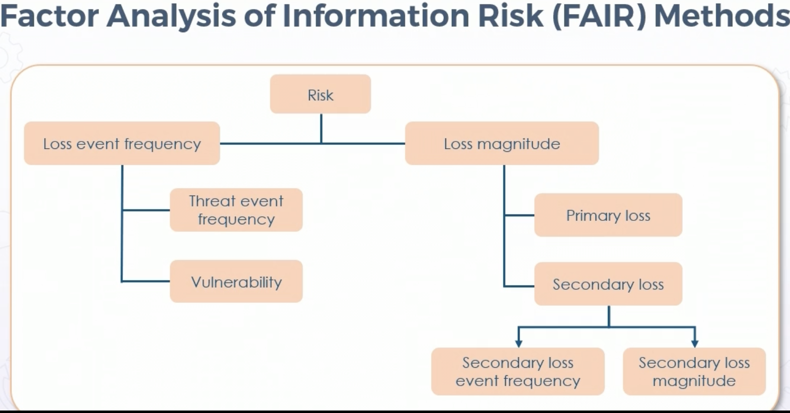

* Loss event freq & vuln = %

* Calibrated estimation, can be further decomposed 

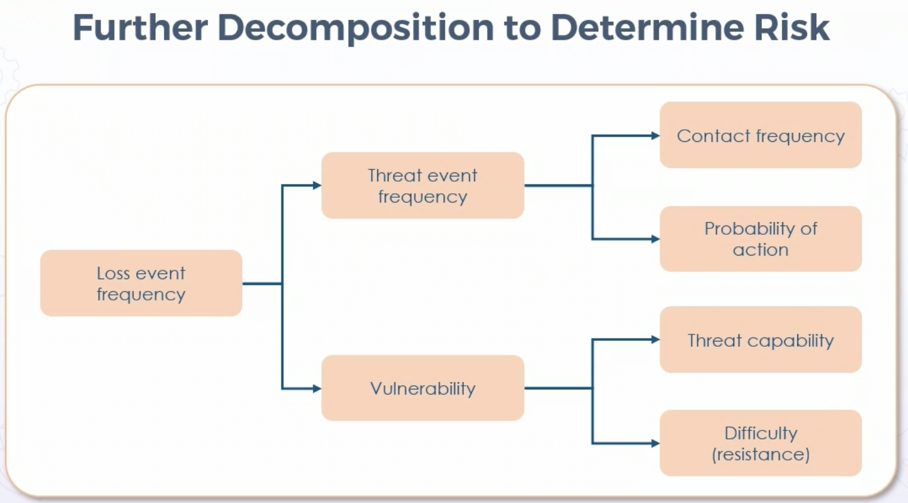

## **Security Control Categories and Types**

### Security Control Categories

* Adminstrative/Managerial - policies, proced, best practices, & guidelines

* Technical - hardware/software controls 

* Physical 

**NOTE** Exam may have "operational" controls - combo of tech & phys

### Security Control Types

* Preventative

* Decective

* Corrective - patch, quarantining, terminating process, etc

* Deterrent

* Compensating/recovery - aids controls already in place

## **Risk Frameworks**

### NIST

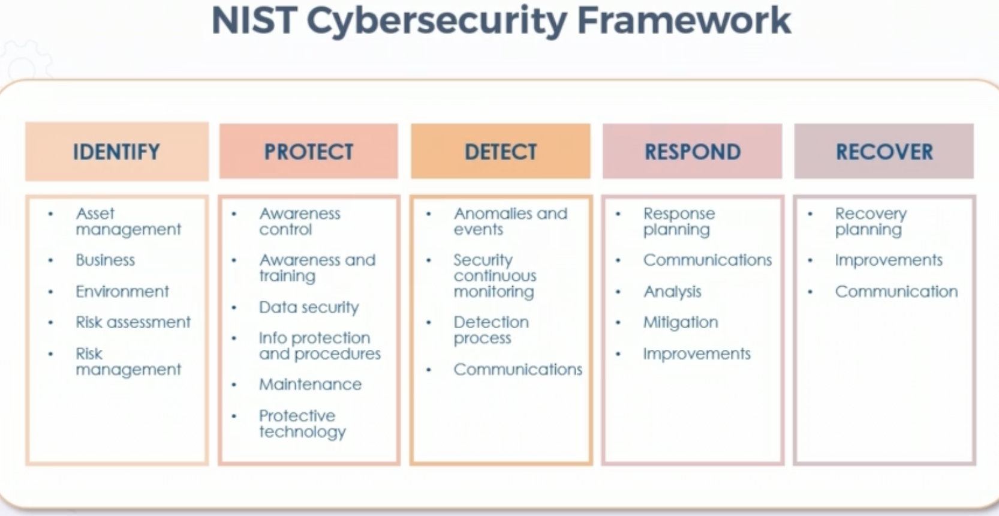

### CIS

* Repo for tools, best practices, assessment & awareness

* Leverages community

    * CIS Benchmarks - consensus config guidelines

    * CIS Controls - strict & ordered set of best practices & guidelines

    * CIS SecureSuite - Combination of resources (membership based)

* Cloud Security Alliance (CSA)

    * Org to define & raise awareness for secure cloud computing

    * Cloud Control Matrix (CCM) for handling requirements from:

        * New cloud tech

        * Controls & security responsibilities 

        * Audibility of controls

        * Interop & compatibility w/other Standards

* Other risk frameworks

    * COBIT 5

    * ISO 31000/IEC31010:2019

    * PCI-DSS

    * ISACA Risk IT (fills in gap b/t generic & IT risk approaches)

## **Countermeasure Selection & Implementation**

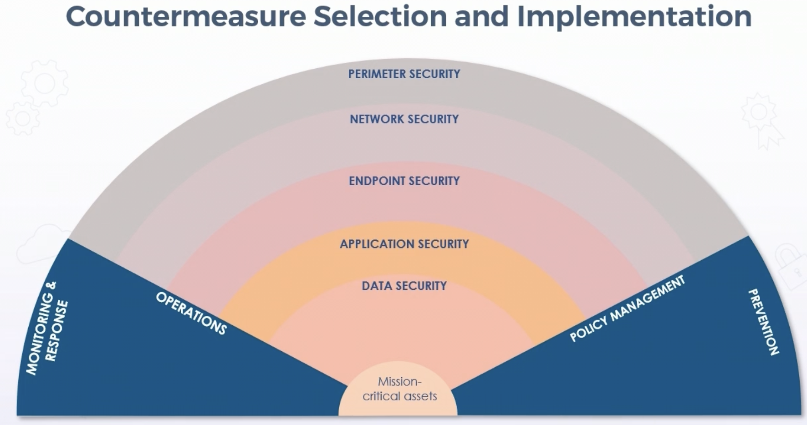

* All the various tools and domains may or may not overlap in large orgs

## **Security and Privacy Control Assessments**

### Security Control Assessment (SCA)

* Formal eval of system against pre-defined set of controls

* Performed in, with, or full Security Test & Eval (ST&E), performed as part of official security authorization

* SCA & STE appraise operational plan of controls

* Results are risk assessment report representing gap analysis documenting the system, application, or data risk

* Tests incl audits, reviews, scanning, and pen testing

* Capability Maturity Model 

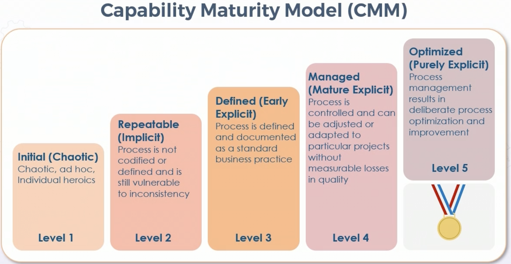

## **Monitoring, Measuring, & Reporting Risk**

### SIEM

* Security Event Management & Security Information Management

* Centralization storage & analysis near real-time

* May ship to analytics tools for additional analysis

* Provides countermeasures, rapid defense, and incident handling

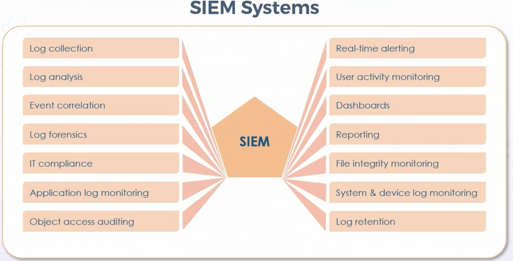

* Not every one provides all

* Common SIEM data sources:

    * Firewall, IDS, IPS, syslogs, infrastructure devices

    * Email & web appliance services & appliances

    * Logging like snmp & traps

### Automation vs Orchestration

* Automation

    * Single task to run automatically w/o human

    * alerts to SIEM, triggering serverless functions in cloud, updating records, etc

* Orchestration

    * Managing several or many automated tasks or processes

    * Combines individual tasks

    * Contanerized orchestration

### Security Orchestration, Automation, & Response (SOAR)

* Assortment of services and tools in three key areas

    * Threat & vuln management

    * Incident response

    * Security operations automation

* Defensive detection, response, & remediation

* Offensive vuln assessment & pen testing

### Reporting

* Meaningful metrics

    * As much as needed w/o overload

    * Simplified report terms or different reports for different audiences

    * Dashboards (often with Python or R)

    * Components of visual communications:

        * Avoid 3D representations

        * Use pallet of sequential colors

        * Avoid pie, use scatter, bars & bubble, histo, density, etc

* Tools that deliver meaningful & useful results

    * CloudWatch, CloudTrail, Operations Insights

    * Automated

    * After Action Reports

## **Continuous Improvement**

### Continual Improvement Models Overlay

* PDCA - plan, do, check, act

* 7 steps:

    ***Data Quadrant***

    * Identify strategy

        * Vision, business need, strategy, tactical goals, operational goals

    * Define what will be measured

    * Gather Data

        * Who, how, when?

        * Criteria, integrity, operational goals, service measuremment

    ***Information Quadrant***

    * Process the data

        * Frequency & format
        
        * Tools & Systems

        * Accuracy

    ***Knowledge Quadrant***

    * Analyze information & data

        * Trends, targets, improvements required?

    ***Wisdom Quadrant***

    * Present and use information

        * Assessment summary, action plans, etc

    * Implement Improvement

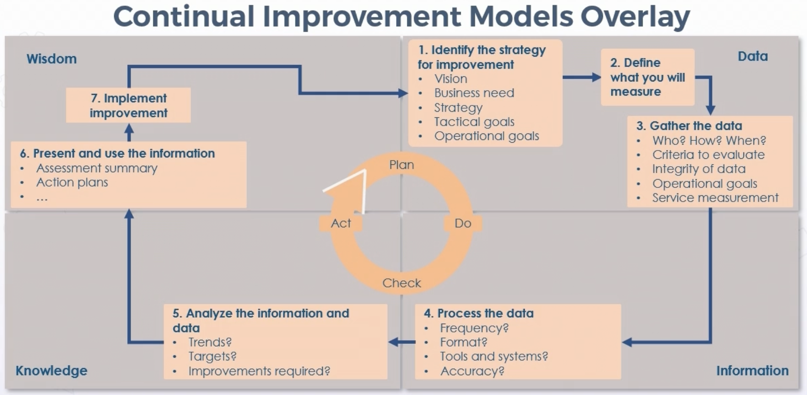

Notice how information becomes knowledge once processed

## **Threat Modeling**

### Threat Modeling Purpose

* Creating abstraction of system 

* Identify risk & probable threats (sandboxing)

* Helps lower vuln & risk

* Spread of threat intel -> threat focused approach to risk management

* Provides visibility, + security awareness, prioritization, understanding of posture

### Threat Modeling Methodoligies

* Stride & PASTA are most common

* STRIDE: Spoofing of User Identity, Tampering, Repudiation, Info Disclosure, Denial of Service, and Elevation

    * Developed by MS in 1999

    * Classifies most common goals of attackers

* PASTA: Process for Attack Simulation & Threat Analysis

    * Risk-oriented method

    * Attempts to link business objectives to technical requirements

    * 7 steps; goal of delivering dynamic process from identification to enumeration and scoring

* Trike - risk modeling during security audits

    * Open-source threat modeling

    * Focused on enhancing security auditing from cyber risk mgmt perspective

* VAST (Visual, Agile, & Simple Threat Modeling)

    * Utilizes more practical approach

    * Founding principal is scalability across infra & DevOps processes

    * Seperate operational & application models

## **Supply Chain Risk Management (SCRM)**

* Modern supply chain challenge: Several or thousands of contributors

* Risks due to scale of contributors

* Proprietary in some tiers, making assessment & monitoring of 3rd party difficult

* Heart of SCRM - meainingful metrics & analysis relating to supply chain risks

    * Cargo disruption

    * Transit modality exposure

    * Threats by terrorist/activists/criminals

    * Country risk - rule of law, local law & order, geo-politics

* Weaknesses in supply chain obvious during COVID

* US CBP & Customs-Trade Partnership Against Terrorism programs involved in supply chain risk & security

* Initiatives:

    * 3rd party assessment & monitoring

    * Setting minimum security & SLA requirements

* Example SCRM Process

 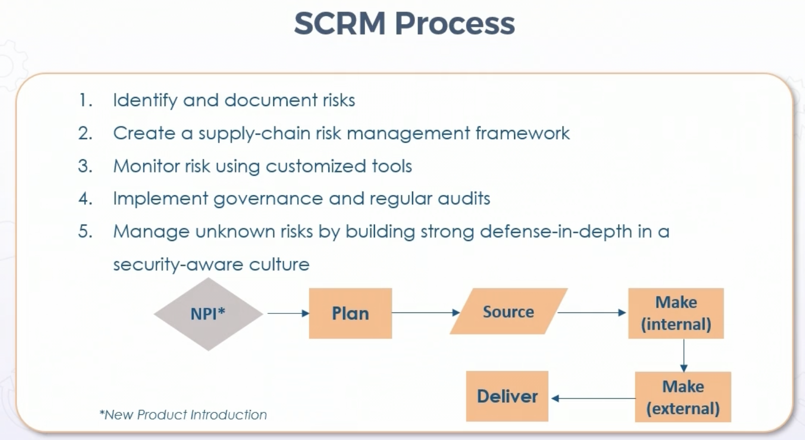

