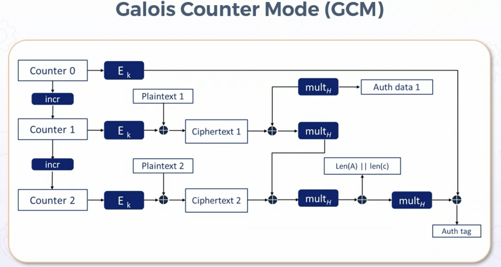
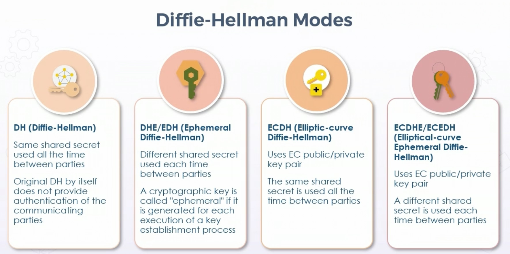
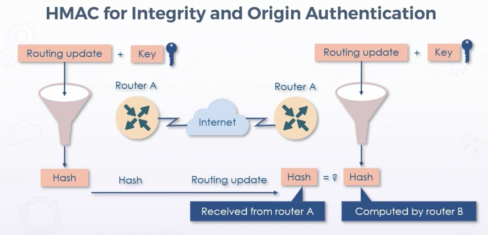
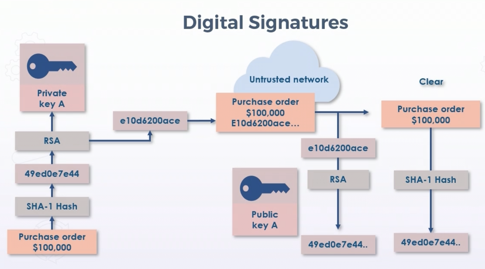

# Practical Cryptography

## Symmetric vs Asymmetric Cryptosystems

### Symmetric Key Algorithms

* Same key for encryption & decryption

* Secret key must be shared between sender & receiver securely

* Strength is related to:

  * Key management

  * Key size

  * Sharing methods

* Commonly 40-512 bits

  * Should never be less than 64 bits

* Wire-speed encryption

* Bulk data encryption

  * VPN

  * CMK at CSP for data at rest

* Deploy confusion & diffusion techinques along w/transposition

* Can be accelerated by hardware - HSM

* Stream & block ciphers most often

  * Stream - XOR

  * Block - ex 128 bits - padded if the block is not 128 bits

### Symmetric Modes

* ECB - Electronic Codebook

  * Each block is encrypted with same key
  
  * Rarely used, improved upon by CBC

* CBC - Cipher Block Chaining

  * Improvement on ECB
  
  * Used in upgrades to 802.11

  * Encryption of each block dependent on ciphertext of previous block

  * Used in blockchain

* CTM - Counter Mode

  * Generates the next keystream block by encrypting successive values of a counter

  * Makes algorithm less deterministic

* GCM - Galois Counter Mode

  * Authenticated encryption

  * Concurrently combines confidentiality, authenticity, and integrity

  * Based on Galois fields

  * AEAD - Authenticated Encryption, Authenticated Decryption

    * Eliminates need for Hashed Message Authentication Code (HMAC)

  * Large initialization vector/nonce (pseudorandom), with counter

  

### Advanced Encryption Standard (AES)

* GCM is one of most popular modes in AES

* AES government standard 2002

* Included in ISO/IEC 18033-3 standard

* First & only publicly accessible cipher approved by NSA for TS when used with NSA-Approved crypto module

### Asymmetric Key Algorithms

* Different keys for enc/dec

* Generated keypair, mathmatically related

* Public key shared, private key kept secret by owner

* 512 - 4096 bits

* Slower, not suitable for bulk data

* Simpler and more secure key management

* Design based on factoring product of large prime numbers

* More suitable for:

  * Generating symmetric session keys

  * Certificate information

  * Digital signatures

* RSA (most popular commercial)

* DSA

* Elliptic curve DSA

* PGP/GPG

* DH

* Privacy/confidentiality: Sender encrypts message with recipient public key, which can only be decrypted by private key

* Origin Authentication/non-repudiation: Sender encrypts with sender private key, which can be verified cryptographically by the public key

### Diffie-Hellman Key Exchange (DH)

* First key agreement asymmetric algorithm used for generating shared secret keys over untrusted channels

* Parties securely develop shared secrets, then use those keys to derive subsequent keys

* Keys then used with symmetric-key algorithms to transmit securely

* DH can be used to establish public/private keypairs, RSA used more commonly instead

* DH is not able to sign public key certificates, where RSA is capable

* DH used by TLS, IPsec, SSH, PGP, et al

* Uses modulo math

* DH Groups

  * 14: 2048-bit modulus - **minimum acceptable**

  * 19: 256-bit elliptic curve - **acceptable**

  * 20: 384-bit elliptic curve - **next generation**

  * 21: 512-bit ellliptic curve - **next generation**

  * 24: Modular exponentiation w/2048-bit mod and 256-bit prime order subgroup - **next generation**

  
 By Original schema: A.J.jacquie MacLaine /Vinck, University of Duisburg-Essen

### DH Modes

* DH
  * Original DH uses same shared secret all the time between parties

  * Does not provide authentication of parties

* DHE/EDH (Ephemeral Diffie-Hellman)

  * Different shared secret each time

  * Ephemeral = generated each execution of key establishment process

* ECDH (Elliptic-Curve DH)

  * Uses EC public/private keypairs

  * Same shared key all the time

* ECDHE/ECEDH (Elliptical-Curve Ephemeral DH)

  * EC public/private keypairs

  * Different shared secret each time

## Cryptographic Hashing

* Hash value/message digest/fingerprint/checksum

* Hashing maps data of any size to fixed-length string

* Varies from 128 to 512 bits

* Based on irreversible one-way mathematical function

* Goal of integrity

* Reliablity depends on:

  * Unfeasability to generate original from hash value

  * Deterministic and quick to compute

  * Any small change in original creates entirely different hash value

  * Collision resistant

### Hashing Algorithms

* MD5 - 128-bit digest - deprecated

* SHA-1 - 160-bit digest - deprecated

* SHA-2 - 256-bit

* SHA-3 - not meant to replace SHA-2

* RACE Integrity Primitives Evaluation Message Digest (RIPEMD)

  * 128, 160, 256, 320-bit versions

### HMAC for Integrity and Origin Authentication

* Hashed message authentication codes

* Shared key for hashing provides message integrity & origin authentication

* Alone does not provide confidentiality or privacy

  

  ***Diagram should say Router A to Router B***

* HMAC often combined with symmetric key crypto to protect data in bulk

## Digital Signatures & Digital Certificates

### Digital Signatures

* Form of electronic signature

* Meant to replace or supplement handwritten signature

* Mathematical algorithm used to validate authenticity & integrity of message

  * e.g. email, credit card or online transaction, digital document

* Do not provide confidentiality or privacy

* Generate virtual fingerprint unique to an entity

* Used to identify users & protect information in digital messages or documents

* Digital signatures more secure than other forms

* Provides high degree of confidence of originality 

### Digital Certificates

* Used to tie cryptographic key pairs to entities

* In public trust scenarios, trusted CA assumes role to validate, identify, and associate parties with cryptographic pairs using the digital certificates

  * Public key included in certificate

  * Owner uses private key to sign messages/documents, public key used to verify validity of signatures

* X.509 (v3) Standard prescribes the following:

  * Public key

  * Digital signature

  * Other metadata linked to certificate, such as serial number

  * Information about issuing CA

## Elliptic Curve and Quantum Computing

### Elliptic Curve Cryptography

* Based on points on a curve

* Algorithm computes discrete logarithms of elliptic curves

  * Different from calcualating discrete logarithms in a finite field

* Smaller and more efficient keys, speed and strength benefits

  * 256 EC key = 3072 "normal" key

* Digital signatures, key distribution, and encryption

* Excellent for mobile & IoT

  * Less processing power, faster, more security

* Elliptic Curve Digital Signature Algorithm (ECDSA)

  * Variant of Digital Signature Algorithm (DSA)

  * Technical and political conerns

* Elliptic Curve Diffie-Hellman

  * Key agreement protocol allowing two parties, each with elliptic-curve public/private keypair, to generate shared secret over insecure channel

  * Shared secret can be used directly as key, or to derive another key

  * Key or derived key used to encrypt further communications w/symmetric key cipher

### Quantum Computing

* Quantum computing uses qubits instead of 1 and 0

* Typically subatomic particles such as electrons or photos

* Qubits can represent numerous possible combinations of 1 and 0 at the same time

* Superposition = ability to be in multiple states simultaneously

### Post-Quantum Cryptography

* Involves devloping new cryptosystems that can be implemented today, but resistant to attacks from future quantum computing

  * Increasing size of keys 

  * Complex trapdoor functions

  * Lattice-based cryptography

  * Supersingular isogeny key exchange

### Quantum Communications

* Leverages laws of quantum physics and quantum computing

* QKD - Quantum Key Distribution

  * Sends encrypted data as normal bits

  * Decryption key information encoded & transmitted in quantum state using qubits

  * Theoretically ultra-secure

### Homomorphic Encryption

* Helps to protect data-in-use (aka data resident in volitaile memory)

* Data remains encrypted while being processed

* CSPs can apply functions on encrypted data - e.g. Reddis Elastic Cache

* Commonly uses public/private keypair

* Algebraic operations on ciphertext

## Cryptographic Lifecycles

### Key Generation

* Main weakness of cryptography is in key lifecycle 

* Key manager or trusted third party must use cryptographically secure random bit generator

* Keys along with attributes stored in key storage database

  * Itself must be encrypted with a master key

* Attributes include name, activation date, size, instance

* Keys may be cryptographically hashed 

* Key can be activated on creation or later 

### Key Distribution and Loading

* Install key into secure cryptographic device (manually or electronically)

  * Into secure enclave on mobile device, for example

* Manual distribution requires distribution and loading in key share to avoid full key in clear

* Symmetric key installation - recommended encrypted by public key or key-encryption key prior to delivery for deployment

* Key should be deployed and tested for given time to ensure operations are successful to avoid potential data loss or theft

### Key Backup and Storage

* Secure backup for recovery

* Can be stored on physical external media, HSM, or traditional network/local backup

* Symmetric keys and private keys should be encrypted further 

### Normal Use and Replacement

* KMS should allow activated key to be retrieved by authorized systems and users

* Should manage current and past instances of encryption key

* Key manager should replace a key automatically through schedule, or if suspected compromised

* Goal while replacing keys is to bring extra key into active use, and covert all stored & secured data to new key

### Archiving Keys

* Offline long-term storage 

* Long term storage in HSM

* Remnants

  * Keys usually have data associated, needed for future reference

    * e.g. long-term storage of emails

  * May be associated data in other systems

* Archived keys must be encrypted for security

* Proven no data still being secured with key before archiving old key

### Key Disposal (Disposition)

* Certain or all instances completely removed

* Should only occur after:

  * Adequate length archival phase

  * Adequate analysis that loss of key will not result in loss of data or other keys

* Three ways to remove a key from operation:

  * Key destruction (most effective)

  * Key deletion

  * Key termination

## Key Management

### Key Stretching

* Lengthening symmetric keys to at least 128 bits

* Initial key (password or passphrase) fed into algorithm, enhanced key produced after many iterations

* Increases brute-force attack time

* Common algorithms - Bcrypt and PBKDF2

* Password managers, software tools, HSMs, or protocols (like WPA3)

### Key Escrow

* Third party has copy or access to private keys

* Access under strict conditions such as court order

* Issues can arrise:

  * Request for access process

  * Legitimacy of request

  * Granting the access

  * How many systems are vulnerable to escrow process

### HSMs

* Tamperproof hardened devices

* Provide crypto processing & protection of keys & functions

* Physical or virtual devices

* Partitioned admin and security domains

* Applies corporate key use policies

* Can be used in place of software crypto libraries and accelerators

* Can store symmetric and asymmetric keys

## Public Key Infrastructure

* Based on concept of "trusted introducer" from PGP

* CA is the trusted third party in a web of trust

* Scalable method for secure distribution & revocation of public keys

* Central trusted introducer stores, issues, and signs certificates

* Public key stored & signed in digital certificate by CA private key

* Certificates can then be exchanged over untrusted networks since public keys (certificates) of entities are now verified with public key of CA

* Two public key algorithms involved:

  * One within the certificate (the subject's public key algorithm) 

  * One used to sign the certificate (the CA)

* Extensions in certificate used for further identification

### Hierarchical CA Trust Models

* Private or Public CAs

* Root CA provides certificate to intermediate CAs - online or offline/airgapped

* Intermediate CAs provide certificates to users or other intermediate CAs

### Certificate Chaining

* Each CA signs public key of one level below

* Common for CAs to cross-certify one another

* CA should be in trusted store

* Chain of trust established by:

  * Issued to field

  * Issued by field

### Expiration, Revocation, Suspension

* Secondary goal of PKI is to revoke trust when warranted

* CRL original method - based on serial number

  * Issued by CA who issued certificate

  * Can be generated by defined intervals - not real time

  * Downloaded by client regularly - not in real time

  * Can also be pushed  

  * Suspension does NOT place serial on CRL

* OCSP

  * Method to determine validity by verification with vendor of cert

  * Online transactional database built on concept of CRL

  * Clients query anytime

  * OCSP improves security, but can impact loading time

  * Not all vendors support OCSP - interop or competitive reasons

* OCSP Stapling

  * Quick verification of TLS certificate validity

  * Server downloads copy of vendor response, delivers to client

  * Server provides validity of own certificate, instead of client requesting information from vendor

  * status_request_extension in TLS 1.2 and up used by client to indicate support

  * Server sends fresh certificate info in TLS handshake

  * Supports only one OCSP response

* Certificate Pinning

  * Associating service with certificates and public keys

  * Three key improvements:
  
    * Reduces attack surface by allowing owners pin CAs that are allowed to issue certificates for their domains

    * Key continuity without relying on public CAs

    * Can be used for authentication using secure channel - e.g. TLS

## Cryptanalytic Attacks

### Cryptanalys

* Cryptanalysis - study & practice of exploiting weaknesses in communication protocols and cryptosystems

* Most known methods like brute force are ineffective

  * Lack of time

  * Lack of compute power

  * Good key management and lifecycles

* Most weaknesses found in implementation & key management, not algorithms themselves

### Classical Cryptanalysis

* Typically invovles 2 disciplines:

  * Mathematical analysis to exploit internal structure of encryption methods

  * Brute-force - treats algorithm as black box and tries all possible keys in keyspace

### Implementation Attacks

* Most commonly side-channel attack measuring electrical power consumption of processor operating on a secret key (SPA)

* Traces 1 and 0's to give information about plaintext or keys

* Typically needs physical access or close proximity

### Social Engineering Attacks

* Trick, coerce, or extort a subject

* Spoofing, hoaxing, shoulder surfing, dumpster diving, phishing attacks, etc 

* Most common vector before other methods - resource cost

### Attacking RSA

* Protocol attacks - exploit weakness in RSA use

  * Padding & proper implementation mitigates

* Mathematical attacks - factor the modulus

  * 1024 is adequate, but 2048-4096 is recommended 

* Side-channel attacks

