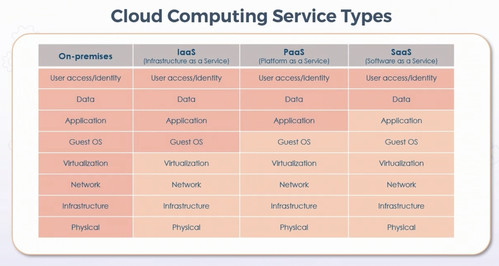
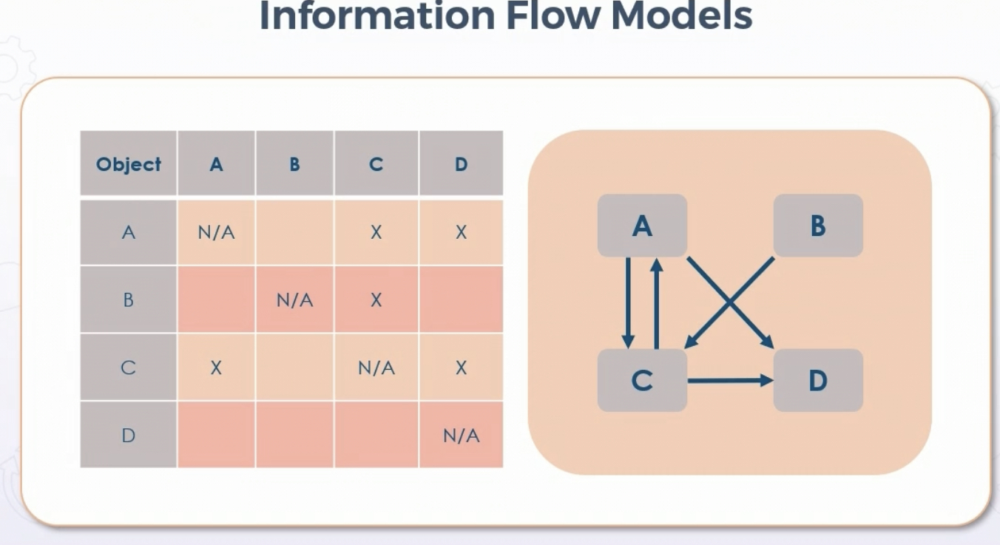
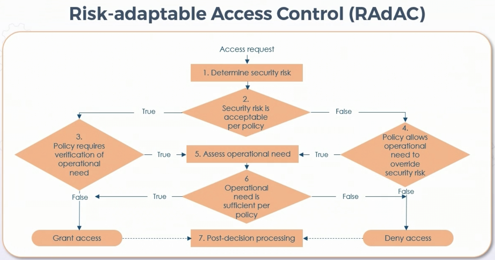

# Identity and Access Management Principals

## **Control Physical and Logical Access** 

### Controlling Phyiscal Access

* Phyiscal access needs controlled as well as logical

  * Includes lighting & cameras

  * Barricades & bollards

  * Fencing/gates/cages

  * Security guards and signage

  * Safes & secure enclosures

  * Protected cabling & distribution

  * Airgaps and mantraps

  * Locking & biometrics

  * Tokens/cards/badges

  * Alarms & sensors

  * Cable locks and screen filters

  * Fire prevention, detection, suppression

### Controlling Logical Access

* Examples:

  * IPsec and TLS VPN gateways

  * 802.1X 

  * IAM MFA - know, have, are

  * Identity providers (AD & Kerberos)
  
  * Access keys & secure logical tokens

## **Cloud and Third-Party Identity Models**

### Type 1 Hypervisors (native or bare metal)

* Hypervisor installed directly on hardware

* Hypervisor not only runs the environment, but "controls" 

### Type 2 Hypervisors

* Hypervisor running on an OS - Virtualbox or Workstation

* Performance lowered, but convenient

### Virtulalization Vulnerabilities

* VM Sprawl - number of VMs exceeds admin ability to manage them & resources

  * DRM or DLP issues, unlicensed software issues

  * Avoiding sprawl

    * Enforce strict deployment process

    * Maintain library of standard images

    * Archive or recycle under-utilized VMs

    * Use VM lifecycle management tool or CSP managed service

* VM Escape - process on guest interacts directly with host OS

  * Protecting against escape

    * Patch VM guests and hosts regularly

    * Only install needed software on host and guests

    * Install verified & trusted apps only

    * Strong IAM access controls and passwords

### Cloud Computing Service Types

### IaaS According to NIST

* IaaS is capability given to provision processing, storage, networks, and other fundamental resources

* Consumer is able to deploy & run arbitrary software, including OS and apps

* Consumer does not manage unerlying cloud infra

### Cloud Infrastructure

* Zones/Availablity Zones within regions

* Edge locations for CDN

* Customer provides IAM on top of IAM of cloud provider

### PaaS

* Consumer deploys onto cloud infra created or acquired applications using programming languages & tools supported by provider

* Consumer does not manage underlying infra, but has control over deployed apps and possibly hosting environment configs 

* Common PaaS services:

  * SDK & Dev platforms

  * Container services for Docker & K8

  * Managed/fully managed relational & document databases

  * Managed security & threat modeling services

  * SSO, ML, AI, IoT, Blockchain, etc

### SaaS

* Use of provider application on provider's infrastructure

* Limited control, settings specific

* Common SaaS services include:

  * CRM

  * HRIS and virtual helpdesk

  * Finance, sales, billing, marketing

  * Email collab, cloud storage

  * BI and security

### Cloud Provider Models

* Private - Deployed within an org at provider location or on prem

* Public - Deployed by provider for customer access & use

* Community - Deployed by consortium in common industry (medical, financial, etc)

* Hybrid - Combination of above

## **Security Models**

### Fundamental Concepts of Security Models

* Used to decide which subjects can access particular objects - specification of security policy

* Typically implemented by enforcing integrity, confidentiality, origin authentication, and nonrepudiation controls

* Designer determines how models are used and integrated into designs

* May be done by individuals or committees

* Securty best enforced with a multilevel or hierarchical security system

### Bell-LaPadula Model

**Bell-LaPadula Model is a Confidentiality Model**

* Frist math model with multilevel security policy used to define concept of secure state machine, models of access, outlined rules of access

* Focus on ensuring subjects with different clearances are authenticated by necessary security clearance, need to know, and formal access approval before accessing 

* All MAC are based on this, adopted by most government agences

* State machine model, used for access control in complex systems

* State of machine is collected to verify security of a system as it defines behavior of set number of states, transitions between states, and subsequent actions

* Particular state typically consists of all current permissions & instances of subjects accessing objects

* If subject can access objects only IAW security policy, then system is considered secure

* Example - open and closing door - two states, transitions betweeen open and closed state

### Bell-LaPadula Ruleset

* Simple security rule: subject at given level cannot read data at higher levels (no read-up rule)

* Star property (*) rule: subject at given level cannot write to a lower security level (no write-down rule)

* Strong star property rule:  subject who has read & write can only perform those functions at same security level - nothing higher or lower

* Tranquility principle: subjects & objects cannot change security levels once instantiated

As Bell-LaPadula is a confidentiality model, there can be exceptions as long as they are decided on by administrator/committee before model is implemented

### Biba Model

**Biba is an Inegrity Model**

* Developed after Bell-LaPadula

* Uses lattice of **integrity** levels

  * Simple integrity rule (no read down): subject can not read data from a lower integrity level

  * Star integrity rule (no write-up): subject cannot write to higher integrity level

  * Invocation property: subject cannot invoke a subject at a higher level

* Both Biba and Bell-LaPadula are information flow models - concerned with data flowing from one level to another

### Information Flow Models

* Data observed in flows in state machine

* Data considered in individual discrete compartments based on classification & need-to-know principles

* Subject clearance overrules object classification

* Subject security profile must contain one of the categories in object label enforcing need to know

* Ex: Bell-LaPadula prevents flow from higher to lower source levels

* Ex: Biba prevents flow from lower to higher integrity levels

### Clark-Wilson Ingegrity Model

* Developed after Biba, deals with information integrity

* Objects can be modified by subjects using read/write operations

* Integrity verification procedures (IVPs) - programs that run periodically to consistency of CDIs (integrity rules usually defined by vendors)

* Integrity goals of Clark-Wilson:

  * Prevent unauthorized users from making modifications

  * Ensure separation of duties prevents authorized users from making improper modifications

  * Ensure well-formed transactions; maintain internal & external consistency

## **Role-based Access Control (RBAC)**

### RBAC

* Access decision typically on org chart, roles, responsibilites, or location in user base

* Roles typically set based on essential objectives and architecture of enterprise

* RBAC framework determined by security admin & officers, not discretion of users

* Roles have rights & permissions 

* Move from DAC to RBAC due to flexibility & ease of management

* Advantages:

  * Ease of implementation & control

  * Roles assigned using written security policy

  * Built into many security frameworks 

  * Aligns with accepted security principles

* Disadvantages:

  * Scope creep

  * Roles & access need rigorous audit

  * Multi-tenancy capabilities need things like AD OUs

## **Rule-based Access Control**

* Can dynamically assign roles based on criteria defined by custodian or system admins

* Can be time based 

* Common for infrastructure devices like routers & switches

* ACLs on gear or on cloud provider infrastructure

## **Mandatory Access Control (MAC)**

* Bell-LaPadula, Biba, Clark-Wilson are all MAC models

* Strictly nondiscretionary 

* Secures data with sensitivity labels, compares labels to level of user sensitivity

* Appropriate for extremly secure systems like multilevel secure military applications

* Main advantage is access based on need-to-know

* Minimizes scope creep

* All MAC systems are based on Bell-LaPadula for confidentiality

* First math model w/multilevel security policy, used to define concept of secure state machine and models of outlined rules of access

* MAC models are nondiscretionary - no object owner to determine other permissions or sharing

* State machine determined by team or committee before any access

## **Discretionary Access Control (DAC)**

* Common in commercial environments

* Restricts access based on identity and/or group membership

* Results based on authorization granted based on creds presented at time of authentication

* In most implementations, owner of resource can change permissions at their discretion

* Can deliver granular access control

* Advantages:

  * Ease of implmentation and operation

  * Aligns with least privilege security principle

  * Object owner has control over granted access

  * Encourages interoperability and productivity in flat or projectized orgs

* Disadvantages:

  * Documentation of access must be maintained

  * Privilege/scope creep

## **Attribute-based Access Control (ABAC)**

* Controls access by weighing rules against attributes of subjects actions & the request environment

* ABAC relies on evaluation of:

  * Subject characteristics

  * Attributes of IT components

  * Heuristics

  * Environmental factors

  * Situational variables

* Capable of both DAC and MAC 

* Example: Cisco ISE

## **Risk-adaptable Access Control (RAdAC)**

* Also called Risk-Based Access Control

* Considers obstacles of traditional approaches

* Seeks to imitate real-world decision making while considering operational & security risk together with every access control decision

* Accounts for situational conditions driving relative weight of operational & security needs 

* Supports extremely restricted and broad sharing rules under specific conditions

* Post decision processing for improvement