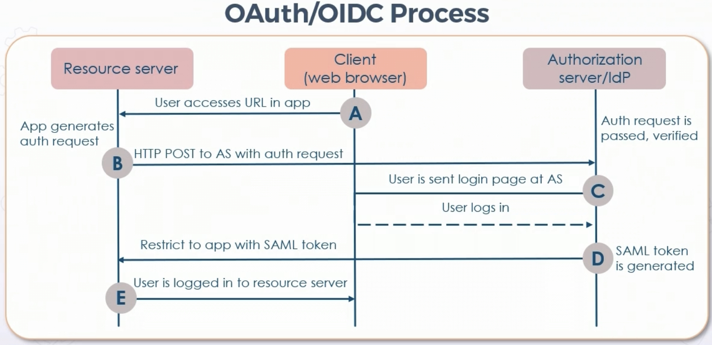

# Deploying Identity & Access Management

## **RADIUS & TACACS+** 

### RADIUS

* IETF-Based client-server protocol

* Enables remote access server (RAS) to communicate with central server to authenticate dial-in users

* Also serves to authorize access to systems

* Transactions between client and RADIUS server for authentication use a shared secret

  * Client is the intermediary - firewall, AP, etc

* Shared secrets never sent over network, only password is encrypted

* UDP 1812 for auth, 1813 for accounting

* Older implementations used UDP 1645 and 1646

* Robust accounting features

* Used with 802.1X per-port

* Next-Gen RADIUS is DIAMETER

* Character mode - admin the intermediary itself

* Packet mode - through intermediary 

* Supplicant = client

* Network device = Network Access Device (NAD)

### TACACS+ 

* Developed by Cisco, not backwards w/TACACS

* Standard protocol

* Dynamic authentication per-user or per-group

* Separate modular authentication, authorization, and accounting

* Each service can be tied to different databases

* Common on ACS/ISE for administrative access control management

* Two-factor password authentication mechanism

* User can change password

* TCP 49, entire payload is encrypted

* TACACS+ services are in public domain, can be bundled into OS of devices

* Devices can leverage per-command authorization for granular authorization

## **SAML**

* SAML built for HTTP/HTTPS authentication

* Federated service using XML-based open-source SSO standard

* Open-source interoperability is key advantage

* Common NFR

* IdP declares identity of user w/additional metadata in an assertion

* LDAP & AD are common IdPs

* Service Provider passes assertion identity data to application or service for authentication

* Cloud services & social media

### SSO Vulnerabilities

* Single point of failure - when single cred used without other factors

* Collusion attacks - secret cooperation between two or more system entities to launch attack - ex. b/t principal and service provider, or principal and identity provider

* DoS attacks

* MitM attacks - active wiretapping 

* Replay attacks - malicious or fraudulent repeating of prior messages

* Session hijacking

## **OpenID Connect (OIDC) and Open Authorization (Oauth)**

### OAuth

* Came out 2005

* iPhone spurred OAuth development

* Open framework allowing third-party app limited access to http services

* Used to publish and interact with protected data in safe & secure manner

* SP use OAuth to store protected data and give users secure delegated access

* Designed to work with http & allows issuance of authorization tokens by authorization server w/approval of resource owner

* Third party then uses access token to access protected resources from resource server

### OIDC

* Basic identity on top of OAuth 2.0

* Verifies end-user identity using authorization server (AS)

* Can get basic profile info about user w/interoperable REST-like methodology

* Supports web, mobile, JavaScript, clients, and more

* Extensibility as functionality can be added

### Shibboleth

* Connects users to inter and intra-org apps and services

* Allows sites to use well-informed authorization choices for discrete access to resources, maintaining privacy

* Free, open source, popular w/universities and public service orgs

## **Kerberos**

* MIT created

* SSO authentication system using secret key cryptosystem

* Uses ticket for assertion or token

* Performs mutual authentication - client authenticates server, and vice versa

* All communications can be encrypted 

* Uses Key Distribution Center (KDC) as trusted third party

* In Windows domains, AD usually provides 

* Kerberos KDC as authentication server and ticket granting server

* Ticket Granting Ticket and session key encrypted key derived from user password

* User uses password to decrypt TGT and requests service ticket from client when accessing a resource

* Ticket contains client name, realm, and timestamp

* Proofing takes place when authenticator encrypted with session key to TGS to receive ticket to the service

* Tickets have lifespan

* Two copies of server session key - one by client key, one by server key

* Service verifies ticket by decrypting

## **Provisioning and Deprovisioning**

* Provisioning involves managing administration of user accounts & assignment of access privileges

* Onboarding of devices and certs often handled by enterprise mobility management (EMM)

* Provisioning should deliver standardized and automated service desk processes for onboarding, transfers, access audits, and onboarding for:

  * employees & contractors

  * Third party business parties

  * Customers

### Enterprise Challenges in Provisioning & Deprovisioning

* Costs of user account management & helpdesk implementations

  * Reduced by CSP or SaaS

* Low priority for security process

* High cost of constant compliance audits of user account admin practices

* Complicated provisioning processes unique to different applications, systems, and platforms

* Lack of timely account suspension & deletions for terminations

* Remote and contract users

### Components of Provisioning System

* Request system - gives users ability to make MACD requests & participate in review processes

* Authorized sources - Permitted origination points - source of truth/system of record for user identity attributes

  * Directory like AD or Open LDAP

* Administrative interfaces

* Workflow processes for changes & emergency changes

* Provisioning Engine - usually provided by directory or OS

* Integrators & Connectors - data feeds from authorized services

  * Sync & federation

* Identity repository - IdP, also groups & permissions

* Reporting tools

* Managed resources - lifecycle management for user & machine accounts, apps, platforms, DBs, and systems

## **Role Definition**

* The type of organization, roles, and responsibilities impact IDM (identity management)

* Section 6 roles tie in 

* In DAC - roles based usually on global group membership

  * Includes data & asset ownership, custodianship, 

* In ABAC, authorization role profile & CoA based on attributes and variables like system and behavior

  * IAM controls what, when, were, and how

* CSPs like AWS and GCP use policies and roles applied to logical groups, typically RBAC with JSON 

### Functional Organization

* Structured around functions enterprise needs to be performed to deliver value proposition(s)

* Functions often mapped to roles like HR, IT, sales, marketing, etc

* Traditional top-down where resources are controlled by functional managers

* Project/program management role usually implemented by team leader of functional area - acting more like project coordinator or expediter

* Authority of these people may be limited

### Projectized Organization 

* Structured around projects & initiatives for effective project management & service management (flatter orgs)

* Project & program managers assume more authority & control (ownership) of resources 

* Initiative managers = full-time role, answer to sponsor on C-suite or senior executive management or officers

* Team members typically co-located (physically or virtually) to optimize communication efficiency

* May still be some functional units w/in org (like HR) - however they are support function w/o authority over projects or program managers, supervisors, & leaders

* IAM typically done through discretionary, attribute, or risk-based access control

### Matrix Organization

* Orgs that perform as combination of functional and projectized orgs

* Classified as weak, balanced, or strong depending on power of functional managers & project managers

  * Weak Matrix = Project/program managers as coordinators or expediters

  * Strong Matrix = Project/program managers have more authority on resources & budgets

* Differences b/t functional vs weak, and projectized vs strong, are not clear cut, making access control more challenging

* Roles & responsibilities, and type of org, have direct impact on IDM / IAM

## **Account Access Review**

* Account access reviews & audits = continual improvement

* Traditional techniques use permission spreadsheets or documented matrices 

* Should be aspect of change & config management practices

* Automation & orchestration should be employed when possible 

  * Ex: AWS IAM provides access analyzer to analyze resource-based JSON policies (permission sets) by machine learning

    * Create analyzer, review findings, take actions

    * Goal is least privilege principles and combat scope creep

### Managing Account Lifecycles

* Security officers typically responsible for auditing account & cred lifecycle

  * Administer process of granting new users access to systems

  * Modify roles when user changes jobs

  * Review roles for new access need requirements

  * Review access on regular basis

  * Remove access of term users

  * Implement account and password policies 

  * Manage SSO & password managers, and CASB sometimes

## **Privilege Escalation**

* Privilege escalation or elevation - subject gets unauthorized access to resources and data

* Can also occur when least privilege is not enforced & users are over-privileged for their role 

* MAC is optimal to prevent escalation of privileges

* Privilege escalation is also a phase of cyber-attack kill chain 

* Must fix flaws in system or application through assessment

## **Implementing IdM and MFA**

* Many enterprises implement identity services engines

  * Who, what how, when, where

  * Can also account for posture, threates, and CVSS

  * Role-based access control, guest access, BYOD, mobile access

  * Wired, wireless, VPN

### Implementing IdM

* Traditional implementations use NAC and 802.1X

### MFA Mechanisms

* Hardware Tokens

* Software TOTP-Based

* PKI-based smart cards

* Digital certificates or devices w/X.509 on them

* SMS, push, email

* Biometrics

## **Managing Identification and Authentication Mechanisms

### Accounting 

* Billing & Chargebacks

  * Often to determine when subject started, when finished, and for how long

  * Chargeback or Showback against department budgets & business unit allocations

* Auditing & visibility

  * Visibility for meaningful metrics for optimization, utilization, and continual improvement

  * Critical to hold highly privileged users accountable to policies and acceptable practices

  * Can be sent to SIEM, NetFlow, or RADIUS/DIAMETER

### Session Management

* Typically refers to technique of securely handling one or several requests to web apps or services from one subject

* Session begins when user authenticates identity w/password or other credential (like assertion, token, or ticket)

* Software application or network operating system is responsible for managing session lifetime

* In TLS, record & handshake protocols manage protection of symmetric session keys w/asymmetric cryptosystem

* Additional mechanisms like EC, ephemeral keys, secure cookies, OCSP, forward secrecy, HSTS, all serve to enhance session security 

### Identity Registration and Proofing

* Registration

  * Must be an authority that serves as IdP

  * DB, LDAP/AD, RADIUS, or MFA/Biometric systems

  * Only necessary info about subject given to requestor

* Proofing

  * Collects attributes or digital documents to support claim of identification for specific subject

  * Uses these attributes to validate veracity of claim

  * Normally executed during registration or enrollment, but can be ongoing

  * Ex. ongoing - knowledge based authorization using data from public records is common (think credit report)

### Microsoft Forefront Identity Manager

* FIM = self-service identity management software for controlling identities, creds, role-based access control policies over heterogeneous environments

* FIM can imbed self-help tools in Outlook for self-service password resets, for example

* Permits users to generate own security and email distro lists, and determine who to put on the lists

* Newest solution is Microsoft Identity Manager (MIM)

  * Hybrid experience, privileged access management, and support for newer platforms 

