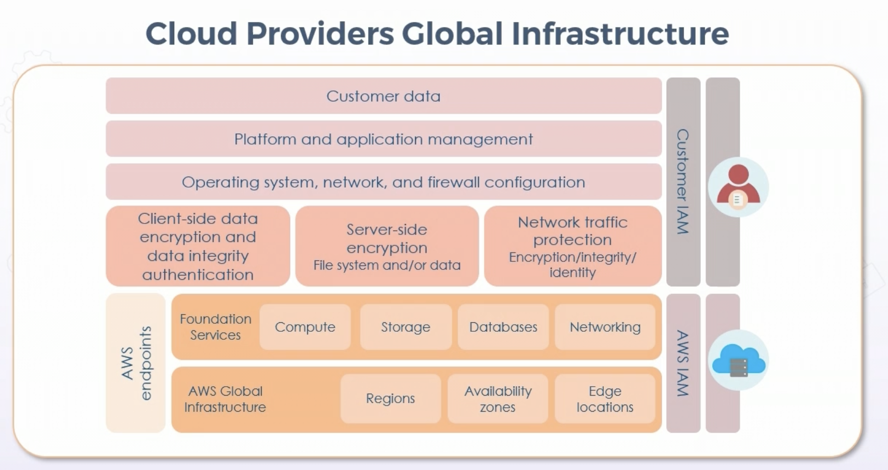

# Architecture, Design, & Solutions Vulnerabilities

## Client vs. Server-based Systems

### Client-side vs Server-side

* Security must have visibility into all client-server channels & interactions for risk management

* From Dev side - server-side or client-side validation

  * Client-side is more efficient

  * Server-side is more secure

* Advanced SIEM and SOAR are valuable in SOC real-time visibility

### Client-side attacks and controls

* Client-side attacks specifically target client software - i.e. browsers, productivity suites, email clients, etc

  * Cross-site scripting type 0 - common client-side attack against browsers using gadgets and applets

* Countermeasures:

  * Patch management

  * Security suites

  * Next-gen EDR

  * Cloud-based security & CASB

### Server-side attacks

* Directly from attacker to a listening service

  * Ex. conficker - tcp445 - expliting RPC weaknesses

  * Variants still active

* Countermeasures:

  * Patch management

  * Infra security (firewalls, IPS, WAF)

  * Secure virtualization & compartmentalization

  * IaaS

## Database Systems

### Database Security: Scoping

* Understand why of database, before how

  * Use case & purpose

  * Schema

* Scope - outline of description on why we are working a problem & why certain data will solve

  * Context

  * Needs

  * Vision

  * Outcome

* Scoping often involves removing baseline security controls that do not apply

  * ex. removing privacy controls where private data is nonexistent

### Database Security: Tailoring

* Modify baseline to become more applicable - ex. lowering application timeout from 20 to 10 minutes

* Scoping is more appropriate for controlling global recommendations

* Tailoring involves modifying details regarding general data that is more preciely appropriate to app or environment

* Tailoring = changes, scoping = removal

### Database Security: Tokenization

* Sending sensitive data through API or batch to replace data with non-sensitive placeholders (called tokens)

* Tokenized data is irreversible and unintelligible

* Ex. removing personal identifiers when sending health data to research hospital

  

### Database Security: Abstraction

* Mediated access

* Makes logical and physical data models more flexible

  * redefines and combines some data elements, enttiies, and relationships

  * Substitutes in more generic terms

* Involves removing details in order to make something applicable across wide class of scenarios

* Preserves important properties & essential aspects from concepts or subjects

* Practically involves more views & indirect access to underlying raw data

### Database Security: Hashing

* Hashing to shorter fixed-length value or key 

* Often used in indexing & retrieval in database, faster to find data using shorter hashed key than original value

* Salting also relates to password hashing

  * Value appended to password to create a different hash

  * Added value is salt, helps protect against brute force or dictionary attacks

* A "pepper" is secret and must not be stored with output

## Industrial Control Systems

### Supervisory Control & Data Acquisition (SCADA)

* SCADA represents software used to collect & send data to other facility systems

* Often used with Programmable Logic Controllers (PLC)

* ICS systems not air-gapped introduce various threats

### SCADA Examples

* Facility manufacturing control & management systems

* Water, electric, and nuclear power grids

* Solar & wind farms

* Pipelines

* Traffic signals & mass transit systems

* Environmental control & manufacturing systems

### SCADA Security Concerns

* Cyber terrorism, warfare, espionage, sabotage

* Lack of security in design, operation, and deployment

* Lack of authentication between devices

* Lack of strong user authentication and MFA / Biometrics

* Lack of security in proprietary controls, services, & applications

* Lack of visibility and security of internet connectivity

## Virtualized & Cloud-based Systems

### Type 1 Hypervisors

* Hypervisor directly on metal - KVM, Citrix, VMware esxi

### Type 2 Hypervisor

* Virtualization installed on host operating system

* Other apps running in parallel with hypervisor

### Virtualization Issues

* VM sprawl - number of VMs overtaking management & resources

  * To mitigate, enforce strict deployment policy

  * Library of standard VM images

  * Archive or recycle under-utilized VMs

  * Use VM lifecycle management or cloud service provider managed service

  * VM escape - guest VM interacts w/host OS

    * More likely in type 2

    * Mitigations:

      * Patch VMs regularly

      * Install only what needed on host & VMs

      * Install only verified & trusted applications - i.e. signed

      * Strong authentication & passwords

### Cloud Computing Service Types

* IaaS according to NIST:

  * Ability of consumer to provision processing, storage, networks, etc

  * Able to deploy & run arbitrary software, including OS and applications

* Example of AWS IaaS

  

### PaaS

* Deploy onto infastructure consumer-created or acquired applications

* Development & SDK platforms

* Container services for Docker & K8

* Managed document & relational databases

* Managed security & threat modeling services

* SSO, ML, AI, IoT, etc

### SaaS

* Use provider's applications running on cloud infrastructure

* Consumer doesn't control underlying cloud infrastructure

* CRM 

* HR and workplace tools

* Fianance, sales, & marketing tools

* Email, collaboration, storage

* Helpdesk/service desk & virtual call centers

### Cloud Models

* Private - on prem

* Public - by provider

* Community - Consortium

* Hybrid - combination of above 3

### MSSPs

* Managed security service providers

* Managed firewalls

* Managed IDS/IPS

* Managed EDR

* Managed VPN, vulnerability, and anti-virus

* MSSP goal is to reduce operational security staff of client

### Cloud Access Security Broker (CASB)

* Software between cusomer and SaaS provider

* Gatekeeper to enforce enterprise security on cloud resources

* Extends organizational policies beyond local infrastructure

* Visibility, compliance, data security, threat protection

* Can assist w/implementation & enforcement of IAM and SSO

## **Distributed Systems**

### Distributed System Attributes

* Enables resource sharing

* Provides concurrency / multi-tenancy

* Openness & transparency - blockchain

* Scalability 

* High-Availability, redundancy, fault tolerance

### Securing Distributed Systems

* Requires more security measures than centralized systems

  * Distributed control

  * Multiple sites

  * Differentiated data

  * Many users

* Consider many different failures & errors, at any time, alone or in combination with other error conditions

* Types of exploits:

  * Passive eavesdroppers (information leakage or data loss)

  * Active attacks that further corrupt messages with new or modified data

  * DDoS and botnets

  * Unauthorized access

* Secure communications with IPsec or TLS

* Authenticated, authorized, validated, and encrypted data at rest

* MACsec at layer2 (802.11AE)

## **Internet of Things (IoT)**

* Challenge in discovering vulnerabilities

* Often power by SoC or specialized chips, or older unpatched/unsupported versions of Linux or Windows

* Example devices:

  * Sensors & smart devices

  * Facility automation

  * Commercial appliances & medical devices

  * Vehicles and aircraft (both manned and unmanned)

  * Smart meters and sensors - power, water, gas, electric, etc

### OWASP IoT Top-Ten Vulnerabilities

* Weak, guessable, or hardcoded passwords

* Insecure network services

* Insecure ecosystem interfaces

* Lack of secure updates

* Use of inseucre or outdated components

* Insufficient privacy protections

* Insecure data transfer and storage

* Lack of device management

* Insecure default settings

* Lack of physical hardening

* Additionally, end of support on ongoing basis

## **Containerization, Serverless, & Microservices**

* Container - isolated abstracted application w/all components (code, bins, libraries, dependencies) included

* Portable modules across platforms & cloud providers for ease & consistency

* Server-based or serverless in cloud

* Isolation done on kernel level w/o need for guest OS

* Allow for rapid deployments, closer parity between dev environments, and unlimited scalability

* Containers are modular & contain all necessary items to run

* Often immutable, replaced instead of upgraded

### Docker vs Kubernetes

* Automation vs Orchestration

* Docker: 

  * Containerization platform

  * Docker engine - runtime that allows build & run of containers

  * Docker = most popular container platform currently

* Kubernetes

  * Orchestrator for container platforms

  * System for automating deployment, scheduling, & scaling of container apps

* Package & distribution - Docker

* Scale, run, & monitor - Kubernetes

### Serverless Architecture

* Moves more responsiblity to provider

* Enhances agility & innovation of applications

* AKA functions as a service when running serverless code

* Enables customer to run container apps and services w/o considering underlying servers

* Elimiates infrastructure duties such as provisioning, patching, maintenance, capacity managemement and optimization

* Can be used for almost all types of apps or back-ends

* Devs can focus on core product vs runtimes and OS

* Reduced overhead allows devs to spend more time on futher delivery 

* Serverless Code (AWS Lambda & Azure Functions)

  * Allows running of small pieces of code called functions

  * Only charge when running

  * No server or application infrastructure deployment

  * Run based on triggers like HTTP request, schedule, API call, security event, manually, etc

* Serverless Containers (ex. AWS Fargate)

  * Serverless compute engine for Elastic Container Service and K8

  * No server or application infrastructure deployment

  * Stipulate & pay for resources per-application

  * Enahnce security through application isolation by design

### Microservices

* Specific service-oriented application components

* Architectural approach to software development

  * Small, independent services that communicate over defined APIs

* Typically maintained by small self-contained devloper teams

* Make development & scaling faster/easier

* Fast-track innovation & delivery of new features & mobile apps

* Tightly scoped but loosely coupled

* Modular and encapsulted

* Independently deployable

* Freely scalable

* Communicate w/notification & queueing services

  * One component fails, the entire app doesn't fail (unlike monolithic software/applications)

## **Embedded Systems**

### Embedded System Security & Constraints

* Complete embedded source code not available

* Many device drivers & components are simple binary sites w/no source code at all

* Rarely applied patches in consistent manner (if available at all)

* 100's of millions unpatched devices

### Raspberry Pi

* Small, single-board computers

* Original intent to teach computer science in schools & developing countries 

* Wide use in robotics, hobbiest, and commercial applications

* Securing RPi and Embedded Systems

  * Updates

  * No auto-login or empty passwords

  * Change default password

  * Disable Pi user

  * Stop unnecessary services 

  * Make sudo require password

  * Prevent ssh root login

  * Change default ssh port

  * Use ssh keys instead of passwords

  * Use sshv2

  * Fail2Ban 

### System on a Chip (SoC)

* Combines various components & software onto single chip

* Common in IoT, mobile, wearables, RFID

* Security concerns include:

  * Lack of security controls

  * Lack of and speed of updates

  * Privacy

  * IoT malware

  * Root access

### Real-time Operating Systems (RTOS)

* OS that serves real-time applications

* Processes data immediately

* Vulnerabilities:

  * Code injection

  * Privacy

  * Shared memory exploitation

  * Misconfigured priorities

  * DoS attacks

  * Inter-process communcations

### Securing Embedded Devices

* Test in cloud before deployment

* Solid change & config management 

* Patch management

* Signed code

* Trusted OS & Firmware

### Other Speciality Systems

* MFPs

* Adaptive voltage scaling (AVS)

* UAVs/Drones - recon, hijacking

## **Trusted Platform Module (TPM) and Memory Protection**

### Boot Integrity using UEFI

* Unified Extensible Firmware Interface - replaces legacy BIOS

* Low-level boot software

* Tests in POST

* Loads OS

* Ability to protect device at low-level with passwords

### Hardware Root of Trust

* Anchoring trustworthiness of system to hardware instead of software

* Hardware more secure than software

* Less susceptable to attack - security solutions are on-chip

* Foundations of Trusted Execution Environment (TEE) or Trusted Computing (TC):

  * TPM - embedded module in system

  * SED - self-encrypting drives

  * HSM - dedicated crypto processor

### TPM

* Chip installed, or built into device

  * Tamper-resistant chip

  * Stores info needed to authenticate system

  * Provides integrity & confidentiality

  * Passwords, certificates, encryption keys

* Provides following for platform:

  * Integrity (ensures system unaltered at low level)

  * Authentication (ensures running on correct system)

  * Privacy

### Self-Encrypting Drives (SED)

* Implements full disk encryption (FDE)

* Hardware-based data encryption

  * All contents are encrypted, including keys, always

  * Encrypts on write, decrypts on read

  * Invisible to user & can't be disabled

  * Less susceptable compared with software 

  * Stolen keys, repurposed drives, theft, end-of-life

* Provides:

  * Pre-boot authentication, endpoint security, and device authentication
  
  * Encryption, key management, network access control, and policy compliance 

### OPAL

* TCG Opal Security Subsystem Class (SSC) - group of specs for SEDs created by Trusted Computing Group (TCG)

* Defines hierarchy of security management standards to secure data from theft & tampering by unauthorized persons who have access to storage device or host system

## **HCP and Edge Computing Systems**

### High Performance & Edge Computing

* HPC facilities - high speed backbones, often run same Linux OS

* History of victimization by same vulns, bugs, etc

* Due to nature of high performance, can use unusual hardware and software stacks

* Often have specific purposes (high-end math) and modes of operation unlike general computing

* Often process sensitive data

* Distributed attacks & malware will spread faster due to speed of systems

* Prime targets of privileged insiders

### Edge Computing Systems

* CDNs

* Distributed computing standard, brings compute & data storage closer to needed site

* Faster repsonse times & bandwidth preservation

* Cached content (often elastic Redis in-memory storage) at metro area edge locations

* Security shared repsonsibility between CDN, ISP, and customers

* Often hybrid between cloud and edge computing

  * EdgeConnect and ExpressRoute

* Securing AWS CloudFront

  * WAF on distribution node

  * Cloud-based DDoS

  * Signed, TLS API calls

  * Private content control who can download

  * Origin access identities control access to original copies of objects

