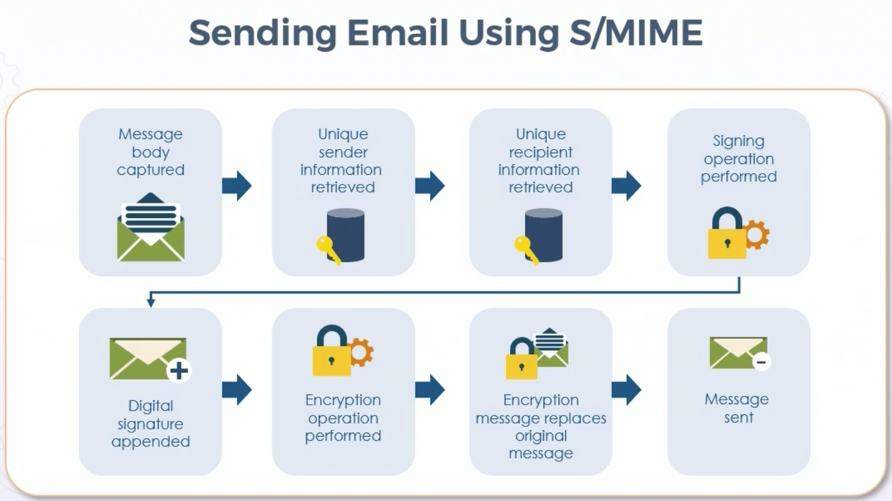
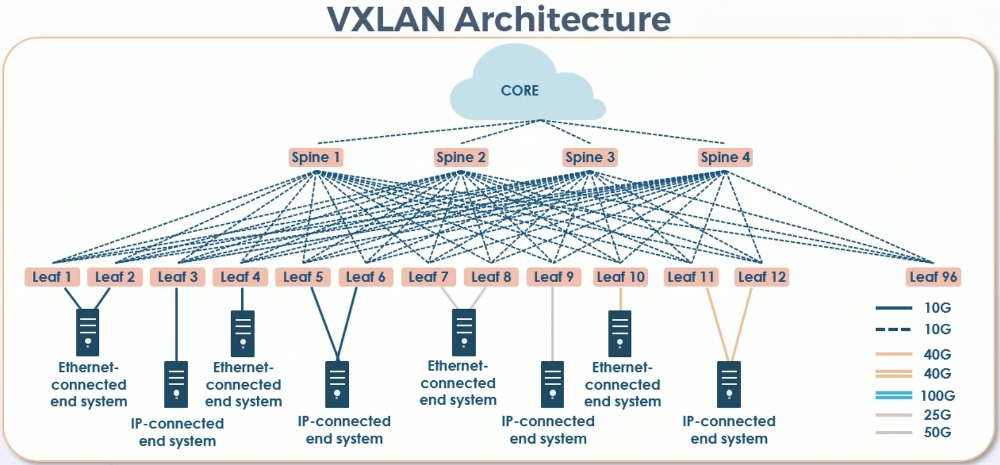
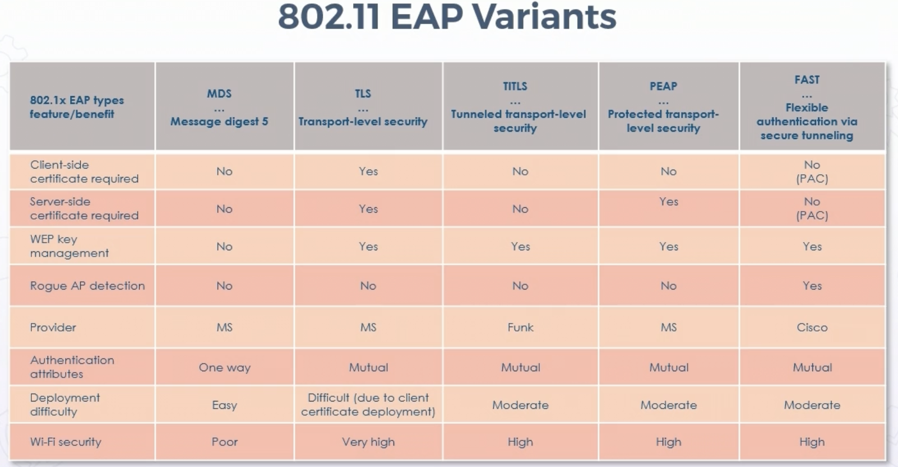
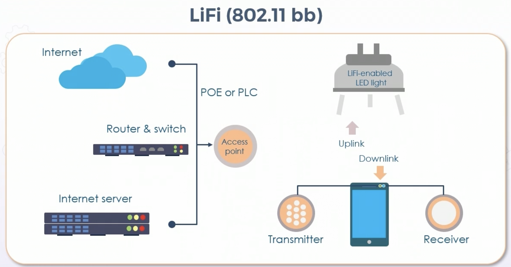
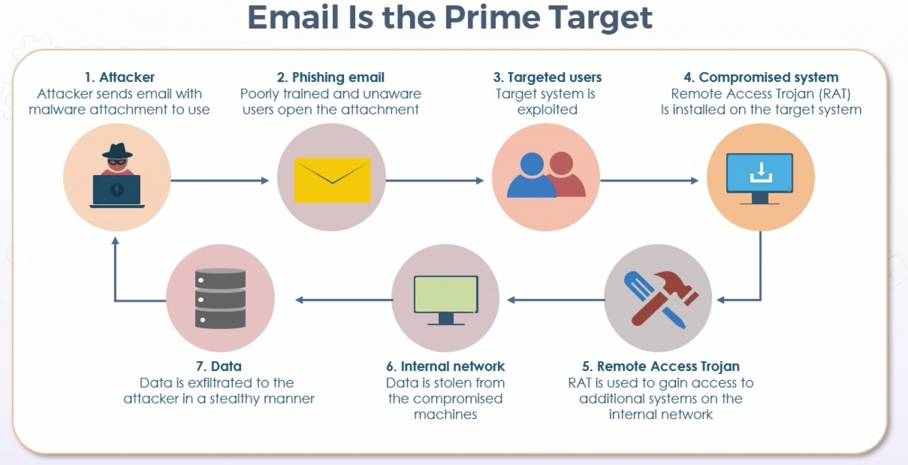
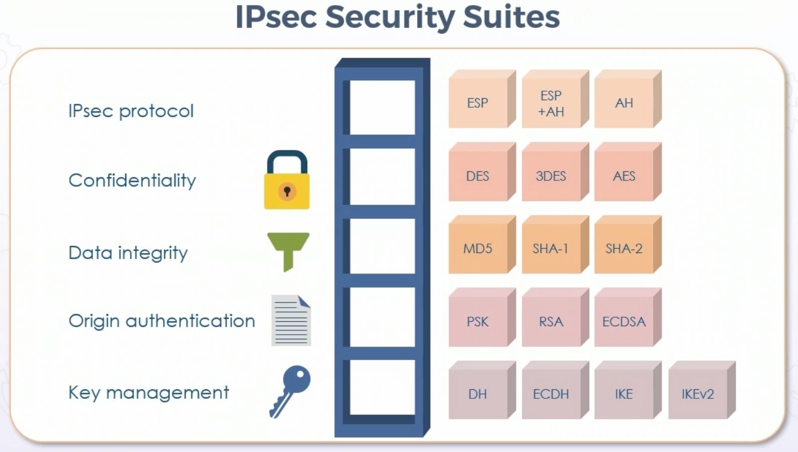
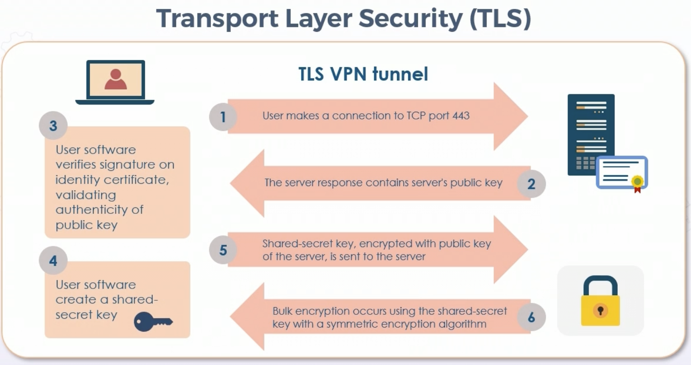

# Communication & Network Security

## **Secure Protocols** 

### SSH2

* Management access should use secure protocols

* SSH2 preferred over SSH1

    * SSH2 uses symmetric encryption for bulk data encryption

    * SSH2 uses asymmetric algorithms for key management

    * SSH uses DH for key exchange

    * On Cisco - required items are hostname, domain name, and crypto key generation

    * Minimum mod 2048

### S/MIME

* Security layer on top of SMTP

* S/MIME v3 is satandard

* Digital signatures most common S/MIME service

    * Provides authentication, integrity, and non-repudiation



### FTPS

* FTP over TLS

* Also called FTP Secure and FTP over TLS

* Typically used for server to server transfers

* Uses AES, RSA/DSA, and X509v3 certificates

* Explicit FTPS - selected parts encrypted

* Implicit FTPS - all communications are encrypted

### SFTP

* Secure shell FTP - using SSH2

* Also called SSH file transfer, as it is component of SSH

* Commands and data are encrypted

* Platform agnostic

* Slower than SCP

### DNSSEC

* Protects DNS spoofing & detection of DNS attacks

* Layer of trust on top of DNS by authenticating response

* Root servers help verifiy domains

* Adds the following record types:

    * RRSIG - cryptographic signature

    * DNSKEY - public signing key

    * DS - hash of DNSKEY record

    * NSEC & NSEC3 - explicit denial-of-existence of a DNS record

    * CDNSKEY & CDS - for child zone requesting updates to DS record(s) of parent zone

### Secure RTP 

* VoIP security

* Extends RTP protocol with security layer

* Provides encryption, integrity, and authentication verification of data & messages using RTP

* 2004 partnership between Cisco and Ericsson

* Uses AES as default cipher in Segmented Integer Counter Mode and f8-mode

    * Allow AES block cipher to be used as stream cipher for RTP data stream

### LDAPS

* LDAP was based on X.500 but cross-platform, standardized, and lighter protocol

* LDAP does not natively provide security of queries, updates, and information within directory

* TCP 636, LDAP over SSL/TLS

* SASL (Simple Authentication and Security Layer) BIND offers authentication services

    * Uses mechanisms like Kerberos or client certificate sent with TLS

### SNMPv3

* SNMPv3 offers three modes:

    * noAuthNoPriv - no cryptographic hash or encryption (passwords instead of community strings)

    * AuthNoPriv - HMAC (SHA1 or SHA2) to secure authentication creds & provide integrity, but no data encryption

    * AuthPriv - HMAC for integrity, AES for encryption data

### QUIC

* Google developed protocol

* Reduces latency compared to TCP

* Built on UDP, eliminating TCP protocol changes unnecessary

* Similar to TCP + TLS + HTTP/2 over UDP, provides:

    * Reduced connection establishment times

    * Improved congestion control

    * Multiplexing without head of line blocking

    * Connection migration

### HSTS - HTTP Strict-Transport Security

* Normal HTTP to HTTPS redirect is vulnerable to MitM during time between HTTP and HTTPS reconnection

* HSTS allows site to instruct browsers to only connect over HTTPS

* Server employs HTTP ```Strict-Transport-Security``` header

## **Micro-segmentation**

### Micro-Segmentation for SDN

* SDN virtualizes network functions by separating control & data planes

* SDN also implements network intelligence into software

    * Typically with hypervisor or proprietary server solutions

* Micro-segmentation is method of zoning in data centers and cloud environments to insulate workloads from one another, and secure them independently

* Allows CSP to offer multi-tenancy for several customers on same common hardware

### SD-WAN

* SDN approach removing network traffic management away from hardware into next-generation software

* Increased agility, control, and visibility

* Centralized control funciton with user-defined applicatioin and routing policies

* Example: AWS transit gateway 

### VXLAN

* Decouple hardware from network map to support virtualization

* Deployment of data center networks programatically

* Allows L2 and L3 transport between VMs and servers

* Larger scale than normal VLANs



## **Detective and Preventative Controls**

### Switch and L2 security

* Switchport security as base configuration on all layer 2 devices

    * Unnecessary in cloud environments

    * Hard code access & trunk ports

    * Mitigate MAC flooding - limit number of MACs on one port

    * Enable PortFast & auto-recovery from err-disable

    * Loop prevention & flood guard techniques against BPDU

* Deploy VLANS & PVLANs to enforce layer 2 trust & compartmentalization

* DHCP snooping, Dynamic ARP Inspection (DAI), IP SourceGuard

* Protect dynamic trunking protocols like VTP

* 802.1X and 802.11AE MACsec

    * MACsec uses AES-GCM-128/256 with GMAC - AEAD (authenticated encryption/authenticated decryption)

### WLAN Controller Security

* Session level access control for management protocols & MFP features

    * Management through HTTPS/SSH

* Control plane policing & CPU ACLs control the control plane & which devices can talk to main controller processor

* IDS/IPS solutions

* SIEM and log event correlation

* Locate rogue radios & APs

### Secure Routers

* NAT

* Infrastructure ACLs

* Unicast & Multicast Reverse Path Forwarding

* Integrated & modular L2-L7 next-gen firewalls & IDS/IPS

* Provide VPN gateways for TLS & IPSEC

* URL filtering & caching 

* Integration w/cloud security services (web, email, DLP, anti-malware)

* Can coordinate with MSSPs

### Firewall

* Software or hardware

* Protection between subnets, vlans, zones, or domains

* Barrier/zone interface point b/t networks

* Single device or multiple 

* Integrated systems of defense at L2-L7

    * Network or specific application firewalls

### NGFW

* L5-L7 policies

    * Also called DPI and AVC

* Authentication proxies - explicit or transparent

* Identity services - ABAC and IdM

* Integrated IDS/IPS - native, modular or cloud based

* Content security - with DLP

* Advanced malware protection

* URL filtering - to enforce AUPs

* Botnet filtering - DNS based anti-DDoS protection

* Cloud correlation & participation - Security as a service (MSSP) integration

### Web Application Firewall (WAF)

* L5-L7 firewall

* Appliance, plugin, or filter applying rules to HTTP and HTTPS 

* Typically covers common web attacks like XSS and SQL inection

* Typically deployed as dynamic web ACLs and anti-DDoS, with other threat management services

* AWS WAF, for example - on elastic app load balancer, CDN, or API gateway

### IDS vs IPS

* Reactive vs preventative

* IDS is not in-line real time - can shun/send instructions to close connections, but does not sit in-line with traffic

* IPS can be passive, to analyze & tune before active

* In-band vs OOB

* Signature based - often updated regularly via cloud

* Anomoly-based

* Heuristic & ML algorithms

* Cloud-based next-gen IPS

### IPS Actions

* Alerts & alarms

* Verbose dumps

* TCP resets to sender or receiver

* Drop packets or address

* Block/shun on firewalls/routers 

* SNMP traps

* Syslog and SIEM logging

* Netflow to collectors

### IPS Tuning

* Reduce true positive and false negatives

### Honeypots & Honeynets

* Isolated systems, sites, & services w/appearance of valuable data

* Entice malicious activity, internal and external

* Track & log traffic to and from honeypot

* Run IDS and other analysis

* Perform active defense procedures

### Active Defense

* Deception

* Attribution

* Counter-attack

### Deception: Fake Telemetry

* First & most common phase of active defense

* Augments existing tools to provide threat intelligence for early breach detection & high-fidelity alerting

* Tools on honeypots for attackers to use, to provide attribution & attack back

* Ex: DNS Sinkhole/Blck hole DNS

    * Spoof DNS servers to prevent resolving hostnames of specified URLs

    * Return false IPs for specific URLs

    * Used to slow attackers & perform active defense attribution

    * Can be used to prevent access to malicious URLs for internal users

## **Wireless Networks**

### WPA2

* De facto standard

* Replaced temporary WPA in 2004

* Supports PSK and enterprise modes

* Stronger encryption w/counter mode cipher block chaning message authentication code protocol

* WPA2 Personal

    * Static shared key for challenge & response during association

    * Manually configured on devices & AP

    * Local access control, replacing WPA TKIP

* WPA2 Enterprise

    * Centralized authentication server required

    * AES for encryption
    
    * RADIUS for authentication & key distribution

        * EAP-TLS/EAP-TTLS

        * EAP-FAST

        * PEAP

### CCMP Encryption

* Used with WPA2 - part of 802.11i standard

* Designed to replaced WEP & interim TKIP using AES

* Strong message encrytpion 

* 48-bit initilization vector, 128/256-bit keys

* Authenticity and integrity checking with CBC-MAC

### 802.11 EAP variants



    * MD5 depricated

### WPA3 

* Disallows outdated protocols

* Requires use of Protected Management Frames (PMF)

    * PMF enhances privacy protections with mechanisms to improve resiliency of wireless networks

* Provides AEAD with GCMP-256

* Key derivation and confirmation: 384-bit HMAC with secure hash algorithm (HMAC-SHA384)

* Key establishment & authentication: ECDH and ECDSA (384-bit)

* Management frame protection: 256-bit Broadcast/Mutlicast Integrity Protocol Galois Message Authentication Code (BIP-GMAC-256)

### WPA3 personal

* Natural password selection - allows users to choose passwords that are easier to remember with SAE strengthening

* Ease of use 

* Forward secrecy - protects data even if password compromised after data transmission

### Simultaneous Authentication of Equals (SAE)

* Implemented in 802.11s

* Password authentication

* Password-authenticated key agreement

* WPA3 replaces PSK with SAE

* More secure initial key exchange

### Dragonblood Attack

* WPA3 vulnerability

* Exploit of dragonfly handshake protcol of WPA3

* Attacker within range of network can recover wifi password and infiltrate target network

* Combination of 5 attacks:

    * 1 DoS, 2 downgrade, and 2 side-channel information leaks

### LiFi (802.11 bb)

* LiFi is mobile wireless technology using light instead of RF to transmit data

* Supported by consortium for wireless integration into 5G core

* Simpler than wireless, using direct modulation, similar to infrared devices like remote controls

* High inensities achieve high-speed transport



### Zigbee - 802.15.04-2011

* PAN technology (personal area network)

* Components connect & communicate using common IoT language

* Network topology is self-forming & self-healing mesh

* 300+ meters with line of sight, 75-100 indoors

* Supports AES-128 at network & application layer

## **Cellular Networks**

### Cellular Networks

* Hotels, airports, commercial scenarios to gather creds or registration profiles before use of public wifi

* 5G is next generation of global networking

* 5G goal is up to 10Gbps using higher frequency radio waves than current cell networks

* Cell devices should be part of enterprise mobility management (EMM)

    * Works with vendors, carriers, and users for policy adherence

### Satellite

* Mobility solutions, GPS, IoT, and even electrical grids

* Uplinks and downlinks often sent through open telecom network security protocols

    * Easily accessed by attackers

* Satellite ground stations are principally vulnerable 

* Military grade satellite communications are subject to all Commercial Solutions for Classified (CSfC) reqirements - including dual tunnel encryption & other packages

* Network soulution infrastructure authenticates communications at every phase of data transmission before sent to satellite

* Trusted computing technology can ensure trustworthiness of devices, device identity, and security validity, using cryptographic keys

* Geofencing & geotagging facilitated by satellite technology

## **Content Distribution Networks (CDN)**

### CDN

* Relates back to edge computing

* Highly-distributed platform of servers

    * Reduces delays in loading content

    * Web and streaming

* Reduces distance between servers and users

* Using edge computing & elastic caching (e.g. in-memory reddis), CDN offloads traffic from origins to metro edge locations

* AWS Cloudfront - Amazon CDN

    * Delivers data, video, applications, and APIs 

    * Often integrated with AWS Redis ElistiCache

    * Integrates with Route 53, S3, ELB, EC2, WAF, and Shield for DDoS

* High level physical security

* TLS 1.1 and 1.2 for connection between edge and origin

* Cipher suites use ECDHE on all connections

* Private content feature controls download ability from CloudFront

* Origin access identities controls access to original copies of objects

## **NAC and Endpoint Security**

### Acceptable Use Policies

* Most important aspect of written security policy

* Endpoint security begins with security awareness of users and contractor

* AUP specifies constraints & practices users must agree to for access to corporate network & internet

* Often divided into different sections based on categories of access

* Should always be an enforcement mechanism to support policy

### Endpoint Physical Security

* Lock computers & laptop docking stations

* Screen savers with strong passwords

* Disable unused ports & perhipherals

* Enforce removable device AUP

* Use MFA with biometrics if feasible

* Clean desk policy

* Provide locking cabinets & closets or secure carrying bags

* Remove/disconnect devices

* Protect printers, fax, and MFPs

* No piggybacking/tailgating policy

### End User Participation

* End users have varying degrees of participation in hardware, firmware, and software updates/upgrades

* If fully autmoated, user may only be able to postpone for certian amount of time

### Personal Security Suites

* Important for teleworkers

* All-in-one security packages that offer single, integrated solution

* Advantage - only one vendor for updates & upgrades

* May include two-way firewall, parental controls, spam filter, VPN, online backup, dedicated ransomeware protection

* Best practice is two products from different vendors

### Email - Prime Vector



### Securing Email/Webmail

* Rotating passwords with 4 random words

* Implement malware & spam filters

* Do not reply or click unsubscribe - serves as confirmation that email address is valid

    * Could also send to malware site

* Training in recognizing phishing email

* Increase in corporate & business email compromise (BEC)

    * Targeting whales & HVT 

* Conduct awareness programs

* Utilize two-tier or MFA for email if available

* Know sender before opening attachments, expecting

* Use encrypted email when possible

* Avoid using email over free WiFi

### Personal Cloud Storage Vulnerabilities

* Backdoor malware

* PDF exploits

* Macros

* Javascript exploits

* Linux malware

* Data loss and leakage

### EDR

* Evolved from early host-based

* Lighter software agent on host

* Focus on detecting & investigating IoCs

* Monitor endpoint & network events, sending to SIEM or centralized control point for analysis, investigation, and reporting

* Key EDR Features:

    * Filtering for lowering alert fatigue, increasing true-positive identification

    * Advanced threat blocking - prevent at detection & through lifecycle of attack

    * Incident repsonse - threat hunting & IR for DLP prevention

    * Multiple threat protection - cloud visibility into many finding categories

### Next-Gen Endpoint Protection

* Partnering with MSSP or CASP

* Advanced AV with ML and AI

* Managed threat hunting / honey tokens

* Cloud-based threat intel and EUBA

* IT Hygiene 

### Heuristics and Behavioral Analytics

* Most next-gen IPS and Av systems use heuristic and ML

* Improvement on signature and anomaly detections

* Proactive rules & behavioral analytics

### NAC and Endpoint Protection

* NAC initiative by Cisco

* Replaced by TrustSec and Zero Trust solutions

* Part of Cisco Self-Defending Network initiative, foundation for NAC on L2 and L3 networks

* No trust inside or outside network without strong authenticaiton and verification

* Helps secure access from users & devices, API calls, IoT, microservices, containers, etc

* Traditional NAC includes CoA, directory, etc

* Cloud-based EDR more common now

## **Secure Communication Channels**

### IPsec

* Security services to traffic over untrusted networks, or between two or more trusted devices

* Can be used to protect management services 

* Popular when connecting to CSP using site-to-site and peer-to-site

* IPsec is native to IPv6 through AH and ESP extension headers

* IPsec and SSL VPN are cyrptographic-based

* Site to Site and Remote Access

* Full-tunnel or split tunnel

* Can be clientless - browser based

* Operates in tunnel or transport modes

* AH - integrity & origin authentication

* ESP - privacy

* IPsec provides 5 essential security functions:

    * Confidentiality (3DES, AES-128/256)

    * Data integrity (SHA1, SHA2/3)

    * Origin authenticaiton (PSK or RSA/ECDSA signatures)

    * Anti-replay

    * Key management (IKEv1/v2, DHKE, ECDHE)



### SSL/TLS

* Most common cert-based peer authentication on internet (HTTPS)

* TLS standardized by IETF

* 1.1 and 1.2 common, 1.3 latest

* SMTP, LDAP, POP3

* Only mandatory cipher suites:

    * RSA for authentication

    * AES for confidentiality

    * SHA for integrity & digital signatures



### TLS Best Practives

* Disallow downgrade attacks from clients

* Use HSTS

* Use most recent suites (No RC4, DES/3DES)

* Do not let vendor code intercept traffic

* Verify encryption

* OCSP stapling from browsers to enforce cert expiration

* Cert pinning to trusted CAs only

### CSP Elastic Load Balancing

* Provide network or application load balancing

* Represents virtual network to public

* Health checks on instances

* Flow logs for threat management

* Run TLS listener

* L3/4 and WAF