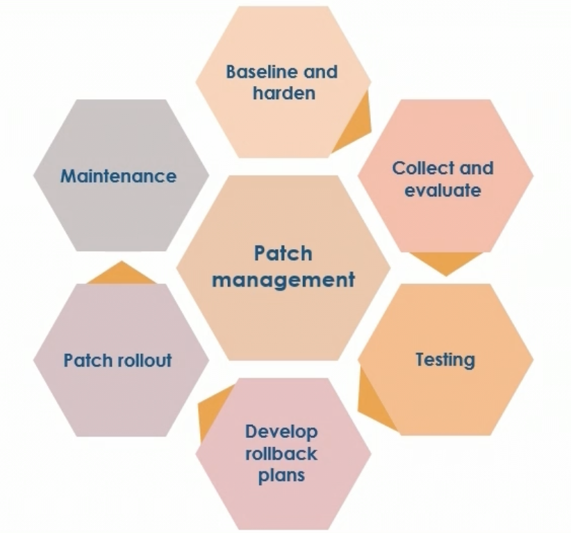
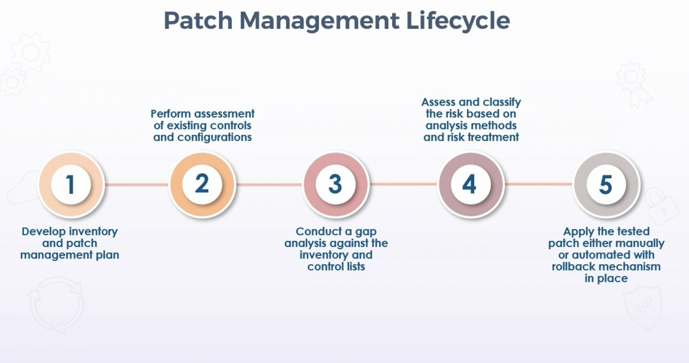
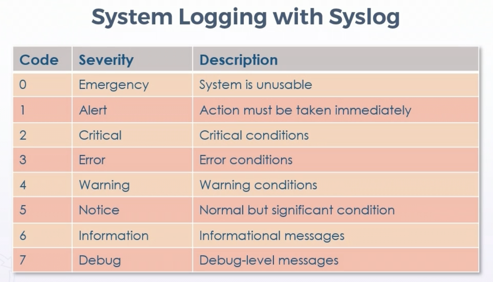
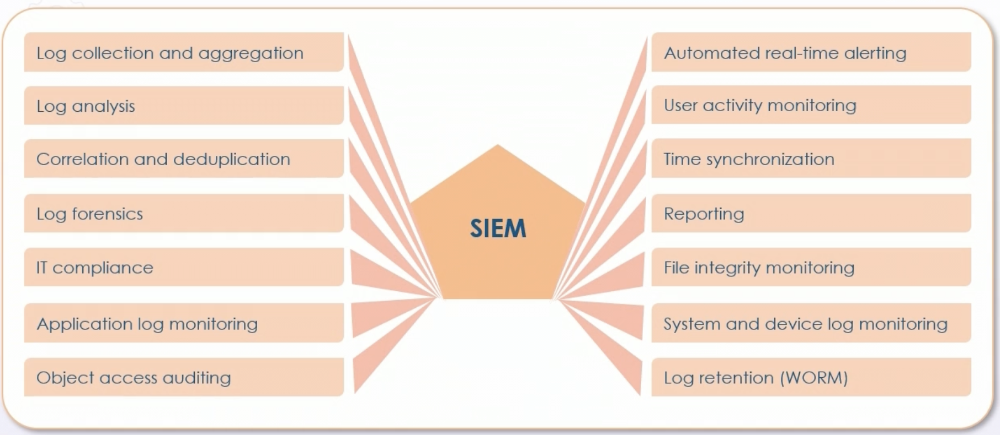
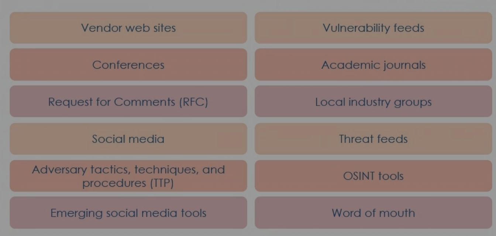
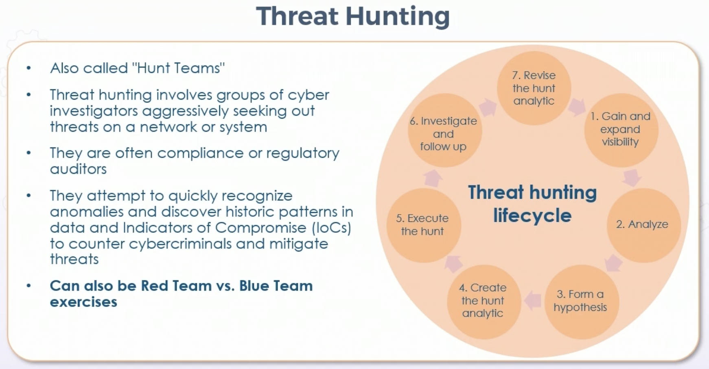
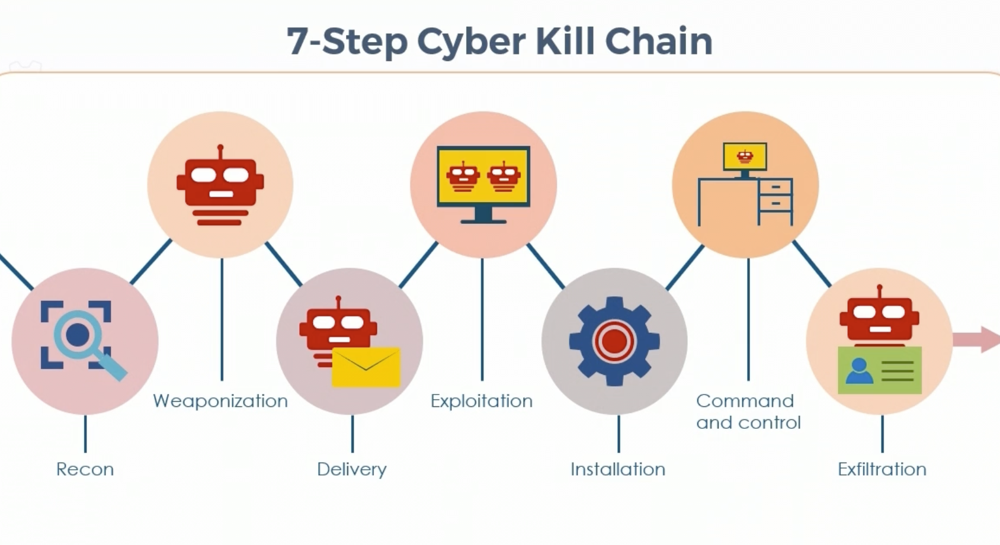

# Security Operations

## **Foundational Concepts in SecOps**

### Need to Know vs. Least Privilege

* Need to Know

    * Originated in military & intelligence operations

    * Pertains to data access & information flow

    * Implemented using various access control models, MAC is most secure

        * Lattice models are effective

        * Bell-LaPadula for confidentiality

        * Biba or Clark-Wilson for integrity

* Least Privilege

    * Subjects given access only to objects needed, nothing else

    * Implemented using various access control models, MAC is most secure

    * Can use network OS controls or ABAC for different scenarios

    * System access or zero trust  models

* In both scenarios, escalation of privilege prevention is paramount

### Separation of Duties

* Porcesses where more than one entity is required to complete a task

    * Backup vs Restore

* Often involves dual operator principles where two subjects are needed to modify a given object

* Automation & orchestration can help enforce separation of duties

* Rotation of duties related principle

    * Forced/mandatory vacations

    * Auditing/compliance testing

### Mediated Access

* Avoids direct client-to-server access

* Uses various proxies for:

    * Authentication (interactive or transparent)

    * NAT

    * Bastion or jump hosts, CSP services

    * Web proxies for content & URL filtering

    * MSSP and CASB

    * Views in DBs vs raw views

### SLA vs OLA

* SLA defines responsbilities of service provider & customer expectations

    * Clarifies support system response to outages for agreed level of service

    * Should be used with third party or cloud providers for 24 hour support

* OLA documents pertinent information for relationship regulation within organization

    * IT and internal service recipients

    * Difference is what service provider promises customer, VS what functional IT groups romise each other

    * Often corresponds to structure of SLA, with specific differences based on enterprise

## **Configuration Management**

* Configuration management - goal of ensuring accurate & meaningful information is readily available regarding configuration of applicaitons & services, along with the configuration items (CI) supporting them

* Includes relationships & dependencies between CIs

* Objects include hardware, software, networks, sites, vendors, suppliers, and people

* CM is governance and systems lifecycle process for ensuring consistency among all assets (CIs) in operational environment

    * Classifies and tracks individual CIs

    * Documents functional capabilities & interdependencies

    * Verifies effect of change to one CI has on other CIs

* CM accmplished using:

    * Directory services tools

    * Diagrams and topologies

    * Inventory baselines

    * Naming and tagging schemas - physical and logical - consistent and accurate

### CMDB

* Configuration management system (CMS) - set of data, tools, utilities, and processes to support configuration management

* Information should be tagged & labeled with a common unified schema, pref. with KV pairs

* This data populates CMDB

* Relational databases uses historically

* Movement towards KV pairs - NoSQL/document databases emerging as common solution

* Can leverage CSP services like AWS DynamoDB 

## **Change Management**

* Chage management comes after configuration management

* Often called change control practice

* Goal is to maximize amount of successful service & product changes

* Risks have been assessed, authorized, and managed with a change schedule

* Operates with CMDB to track dependencies & understand repercussions of changes

* Involves change log or change database

* Ability to roll back or fall back to previous state

### Types of Changes

* Standard

    * Low-risk

    * Pre-authorized & well documented

    * Can be automated

    * Service requests that don't need additional authorization - e.g. directory password change

* Normal

    * Follows specific process for scheduling, assessment, and authorization

    * Lower risk, but go through approval process

    * Ex: Onboarding new phone/laptop; installing application

* Emergency

    * Must be implemented immediately

    * Often result of problem management or after-action reporting 

    * May involve escalation or advisory board if resources or significant

### Change Management Phases

* Submitting

* Approving - often with RACI 

* Documenting - into log or CMDB

* Testing - allows for modification if issues arrise; commonly feeds a new submission if issues found

    * Dependency testing

    * Build in roll-back or fall back method

* Implementing - schedule, document phases & milestones

* Reporting - Trigger iterative move to problem management 

## **Patch Management**

* CIS critical control

    * Consider & improve patch management planning

    * Vulnerability/exposure reviews & gap analysis critical to patch management

    * CMDB of all CIs should be maintained

    * Only certain personnel should have authority to test, apply, and determine urgency of patches

    * Agreements with vendors should be made to address issues before patch deployment

### Components of Patch Management

### Patch Management Lifecycle

## **Logging and Monitoring Activities**

### Syslog

* RFC 5424, well established

* Informational & event messages to syslog server or SIEM

* Gathers device logs from various systems to central system

* UDP 514 or TCP 1468

### Severity Codes

* Level 4 and level 5 popular choices

* Level set and lower is what is logged - ex. 4 down to 0

* Mnemonics: 

    * Do I Notice When Every Crisis Always Escalates

    * Every Awesome Cisco Engineer Will Need Icecream Daily

### Security Information & Event Management (SIEM)

* Centralizes storage & analysis of logs & security-related documentation for analysis

* Can filter & forward data to mining, big query, and warehousing 

* Allows countermeasures, rapid defensive actions, & incident handling

 * Not all SIEM platforms do all tasks, but many can

### Security Automation vs Orchestration

* Automation - singlular task 

* Orchestration - managing several or many automated tasks or processes

### Security Orchestration, Automation, & Repsonse (SOAR)

* Assortment of software services & tools

* Simplifies and aggregates security operations in three core areas:

    * Threat & vulnerability management

    * Incident response

    * Security operations automation

* Security automation - security related tasks without need for human intervention

* Can be defensive detection, response, and remedation

* Can also be offensive vulnerability assessment and pen testing

* Automation should be done on routine, monotonous, and time-intensive tasks

* Output from Syslog, SOAR, and other systems are part of vuln assessment and management

## **Vulnerability Assessment and Management**

* Must define vulnerability is before it can be assessed and managed

* Should be quantified as percent of probability, not a list of scary stuff

* Likelihood that threat will result in loss (frequency and magnitude, or probability and impact)

* Can be derived value from threat capability combined with resistance of existing security controls

* Should be scenario based over given time period

* All assets and asset classes must first be valued, prioritized, categorized, classified, and labeled accurately

* Recognize role of asset manager (and digital asset manager)

* Use all available tools and proven methods

    * Inventory systems & various logs

    * SNMP traps

    * NetFlow 

    * SIEM 

    * NGIPS and logs

    * Cloud visibility tools

    * ML and AI analysis

### Expert Judgement

* Expert judgement needed for proper vulnerability assessment and management

* Internal SMEs

* Risk register & lessons learned

* Historical documentation

* Compliance experts

* External expert judgement/SMEs

* Third-party consultants

* Cyber insurance providers

* Legal expertise

### Vulnerability Intelligence Sources

* Automated Indicator Sharing (AIS)

    * DHS system for cyber observable sharing

    * Goal of maximizing near-real-time distribution of relevant and actionable threat indicators

    * Federal and private agencies

* Trusted Automated Exchange of Indicator Information (TAXII)

    * Free & open transport mechanism for standardizing automated exchange

    * Supports push and pull queries - subscription feeds and on-demand queries

    * Leverages existing protocols - usually HTTPS

* Structured Threat Information Expression (STIX)

    * Structured language from MITRE

    * Supports collaborative representation of threat intel and observable data

* Predictive analysis & threat maps

    * AI & ML

    * Often working with CSP managed services or MSSPs

### Open-Source Intelligence (OSINT)

* Data or information on individual or organization colleted legally from free, public sources

* Usually found on internet but can be sourced from:

    * Books or reports in public library

    * Articles in newspaper or magazine

    * Press releases

    * FOIA reports

* Can be gathered using tools like Maltego, sharing centers, and code repos

### Vulnerability Databases

* Common Vulnerabilities and Exposures (CVE)

    * List of entities from MITRE

    * Represent publicly knwon vulnerabilities

    * Consists of ID number, description, and public references

    * Used by National Vulnerability Database (NVD)

* Common Vulnerability Scoring System (CVSS)

    * Open standard for weiging vulnerabilities

    * Consistent scoring from 0-10 (10 being worst)

### Vulnerability Scanning

* Using tools to find known & unknown weaknesses in systems, applications, services, and policies

* Easier and more focused process of looking for unpatched systems, misconfigurations, and open ports

* Typically automated & done on routine basis

* HTTP/S most common traffic by far

* Scanners like Burp Suite & OWASP ZAP are popular

    * Often looking for XSS; CSRF; SQL, LDAP, and command injection; path traversal; insecure config

### Protocol Analyzers

* Devices that capture & analyze entwork traffic between two or more systems

* Traffic then filtered & decoded to visualize processes that are taking place

* Can be used to find network bottlenecks, troubleshoot, and analyze malware behavior

* Can also generate statistics for trend analysis and network optimization

* Malicious use for gathering information - clear text usernames & passwords

### Exploitation Frameworks (EK)

* Exploit kits to find vulnerabilities and attack vectors

* Often specialized scope - i.e. router, browser, embedded, powershell, etc

* Often open-source

* Can be used to prioritize vulnerabilities and threats

* Common kits - RIG EK & RIG-v EK

    * Grandsoft EK

    * GreenFlash Sundown

### Compliance Scanners

* Compliance audit different from vulnerability scan, with some overlap

* Decides if system is configured in agreement with recognized governance policy

* Sometimes audits more sensitive data & systems

* Diverse forms of financial & government compliance requirements

* Typically, compliance requirements are minimal baselines that can be taken differently depending on goals of organization

* Compliance requirements must be in line with business goals to ensure risks are correctly recognized and alleviated

### Security Audits

* May be for compliance or to measure maturity against models

* Interal or external

* In house vs third party

* Vulnerability asseessment

* Penetration testing

* Log reviews

* Synthetic transactions - active audits 

* Code review & testing

* Misuse case testing

* Test coverage analysis

* Interface testing

* Account management

* Management review & approval

* KPI and risk indicators

* Backup verification 

* Training & awareness

* DR and BC

### Penetration Testing

* Will involve vulnerability assessments 

* More elaborate test with simulated real-world attacks to identify methods for evading security

* Often launching real attacks on real systems & data using tools & techniques

* Also useful for:

    * System analysis for resilliance against real-world attack patterns

    * Likely level of sophistication attacker needs to compromise a system

    * Determine additional countermeasures needed to mitigate system threats

    * Defenders' abilities to detect and respond

* Lifecycle: 

    * Scope/Rules of engagement agreement

    * Recon & initial engagement

    * Escalation of privileges

    * Lateral movement and pivoting

    * Persistence

### Threat Hunting

### Threat Modeling

* Creating abstraction of system to identify risk & probable threats (private cloud/sandboxing)

* With widespread adoption of threat intel tech, many enterprises are adopting threat-focused risk management

* Provides visibility, increased security awareness & priorities, and understanding of posture

### Reporting

* As much info as necessary but not overloaded

* May need to express simply, or have different reports for different audiences

* Dashboards effective (R programming)

* Components of visual communications

    * Avoid 3D representations

    * Palettes of sequential colors

    * Avoid pie charts - use scatterplots, bar & bubble charts
    
    * Avoid histograms - use density plots, and boxplots

## **Incident Repsonse and Management**

* Steps taken when nagative event disrupts normal operations

* Primary goal of reducing immediate impact

* Should be documented incident types/category definitions

    * Based on risk assessments, registers, and BIA

* Defined roles & responsibilites of initial responders, including reporting requirements and escalation processes

* Contact lists, public relations contacts, legal teams

* Best-practice of pre-performed exercises, drills, and simulations 

### Incident Response Lifecycle

* Preparation

    * Information gathering, missions, charters, and project initiation takss

    * Buy-in and funding from exec anagement to know scope of response plan

    * Establish teams

        * Determine roles and responsibilities of internal employees

    * Establish first responders & processes for communciation to stakeholders

    * Conduct IR and drills based on budget

* Detection/Identification

    * Separate an event from incident or breach immediately, using pre-defined metrics and expertise

    * Categorize and prioritize incident based on established risk register/risk ledger

        * When did it occur

        * How were you alerted

        * Who made discovery

        * Scope of impact

        * Does it qualify for escalation or DR

        * Can the root cause be quickly identified

            * Main goal of IR is not to identify root cause, but root can help identify remediation

* Response

    * Main goal is containment

    * Implement short-term processes, i.e. disconnect from network

    * Use firewalls, NGIPS, ML, and other forensic tools to separate, contain, and segregate

    * Evaluate backups and snapshots for future recovery

* Mitigation/Eradication

    * Often integrated with response instead of a separate action

    * Determine root cause and apply immediate remedies (if available)

    * Removing indicators of compromise, and any action, artifacts, remnants, or fingerpints associated with attack

* Recovery

    * Restoring affected data, apps, systems, and devices to established baseline, or original state if possible

    * Primary goal is returning to state of acceptable performance

    * Often involves remedation to certain point and not total recovery

    * Vital to establish there is no further danger of another incident or breach

    * Often involves BIA metrics and indicators like RTO, RPO, and MTTR

* Remedation

    * More elaborate than recovery

    * Involves remedy that puts application or system to state before incident occurred

    * May take hours or weeks, depending on if incident is a disaster or catastrophe & business continuity is occurring

    * Recovery & remediation are often combined into same stage/phase of incident response

* Reporting

    * Generated from physical, digital, and/or audio notes throughout entire process

    * Final reports should:

        * Be concise and comprehensive

        * Generate with different audiences in mind

        * Use newer graphical representation

        * Include recommendations to prevent future incidents

        * Take problem management into consideration

* Lessons Learned

    * Knowledge gained from process of conducting incident response program

    * Sessions usually held at response close-out

    * Goal is to share & use knowledge from an experience

    * Endorse recurrence of positive outcomes

    * Prevent recurrence of negative outcomes

    * Avoid blame, although someone may be held accountable if due care & diligence were not performed

### 7-Step Cyber Kill Chain

## **Digital Forensic Investigations**

* Why?

    * Laws may be violated

    * Policy voliation

    * Systems attacked

    * Data & identity breached

    * Intellectual property exfiltrated

    * Privileged insiders suspected

    * Next phase of organizational incident response

### E-Discovery

* Focus of this certification is on cyber forensics, not crime forensics

* Technologies to lower risks & costs associated with big data, especially in litigation and corporate/government investigations

* Four phases:

    * Identify & collect electronic documents

    * Sort data by relevance

    * Creating production sets

    * Data management

### Forensics Lifecycle

* Identification of a crime

    * Detecting incident

    * Determination that it is not an event, but an incident that needs forensics

    * May not occur until later in IR lifecycle

    * Notification may come from:

        * Personal complaint

        * Monitoring system alarm or alert

        * Audit result

        * IDS/IPS/EDR sensor alarm

        * Notification from trusted or anonymous source

* Collection of evidence

    * Order of volatility sets priority:

        * CPU, cache, register content

        * Routing table, ARP cache, process table, kernel statistics

        * Memory

        * Temp file system/swap space

        * Hard disk data

        * Remotely logged data

        * Data on archival media

    * Forensic toolkits (EnCase from Guidance), write-blockers

    * Common utilities:

        * tcpdump and dd

        * nbstat and netstat

        * nc (netcat)

        * memcopy

        * tshark

        * foremost

    * Maintain chain of custody

        * Imaging technologies to create copies

            * Memory dumps from write blockers

            * HDD bit-level copy, sector by sector

            * Include deleted files, slack spaces, and unallocated clusters

            * Encrypted files and volumes

        * Digital pictures & interviews

        * Provide history of handling to:

            * Maintain integrity

            * Provide accountability

            * Prevent tampering

            * Provide assurance throughout lifecycle

        * Chain of custody documentation

        * Media management

            * Software inventory for configuration items and category for components removed for investigation and forensics

            * All should be classified and labelled

            * Secure storage with dual operators include:

                * Locked rooms

                * Locked cabinets

                * Safes

                * Offsite storage 

* Examination

    * Where data becomes information

    * Involves finding, sorting, and filtring data

    * Use tested techniques for:

        * Validation

        * Filtering (i.e. user SIDs)

        * Pattern matching

        * Tracing

        * Hidden data discovery

        * Data extraction

* Analysis

    * At this point - data becomes information - we analyze information

    * Building forensic case

    * Operating on relevant data, facts, and artifacts from collection & examination phase

    * May determine that more work should be done in earlier steps

        * Iterate back to collection & examination if so

    * Answers the 'who, what, where, when, why, and how'

    * Infer motive, opportunity, and means

    * Combination of art & science that takes mastery

    * Use expert judgement of others

* Report on findings

    * Communicate results

    * Track people hours & expenses

    * Provide electronic & physical documents of all findings

    * Meet with proper authorities & possibly prepare to offer expert testimony

    * Provide needed clarification

    * Identify overall impact on business, recommend countermeasures or improvements

    * Who, what, when, and how - important for court & other proceedings