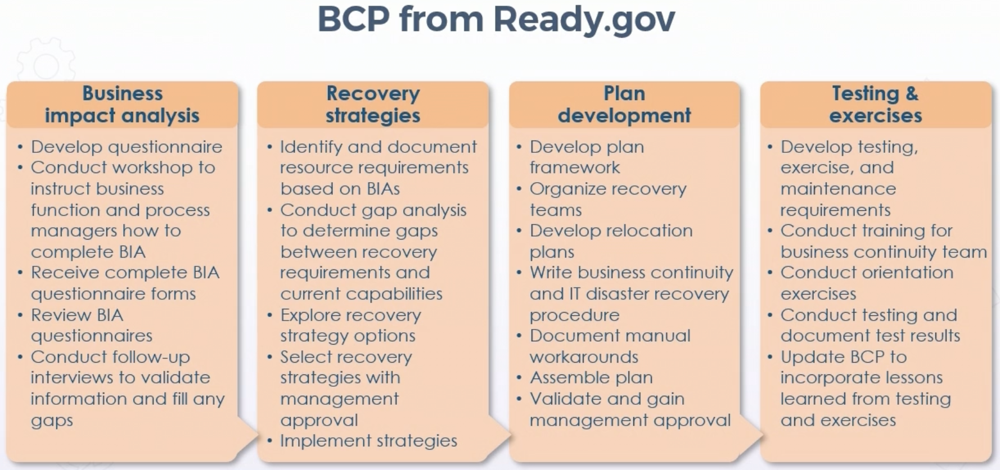
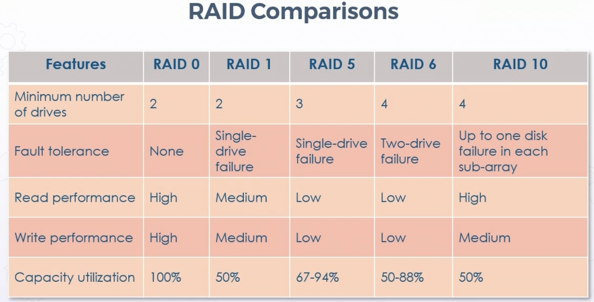
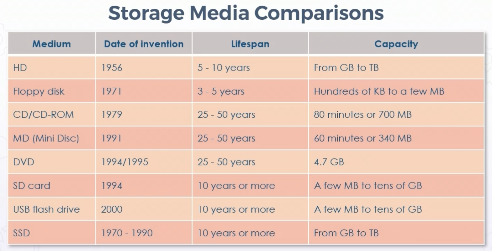
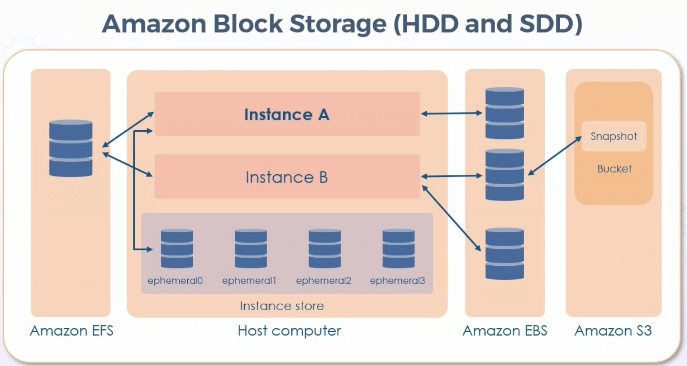
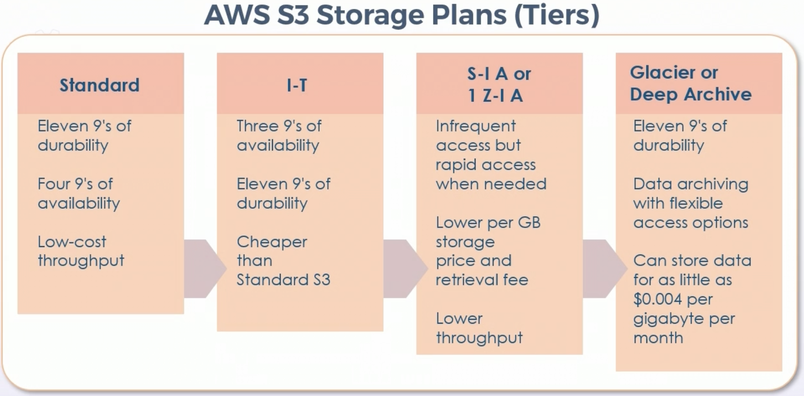
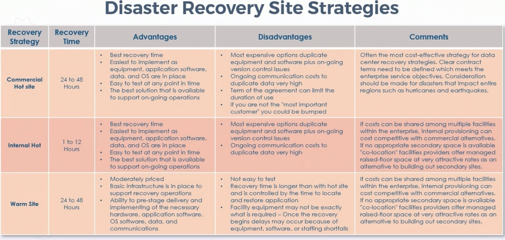
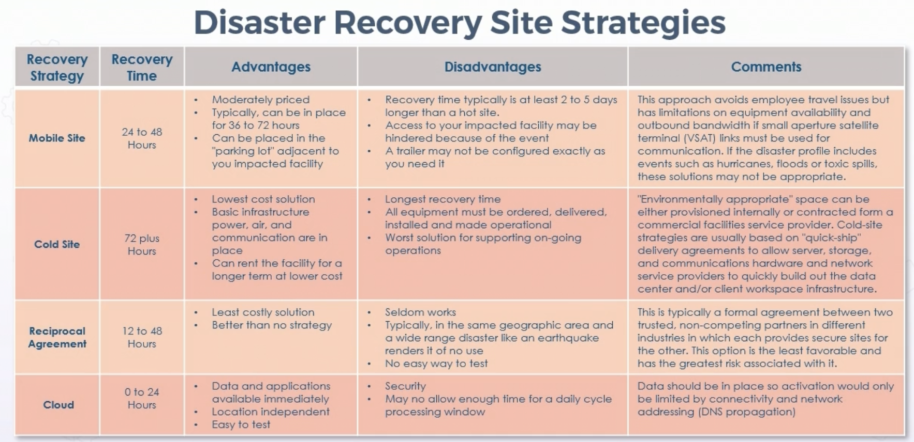

# Business Continuity Planning

## **Business Impact Analysis (BIA)**

* Risk assessment aspect of BCP

* Identify critical functions & prioritize based on need for survival

* Gather meaningful metrics and indicators

* Identify risks associated with critical functions

* Assess probability (likelihood) of risk occurring

* Impact risk will have (magnitude)

* Identify how to reduce or eliminate risk

### Key BIA Terminology

* Recovery Time Objective (RTO)

    * Target amount of time within process must be restored after disruption

* Recovery Point Objective (RPO)

    * Maximum targeted period in which asset or data may be lost from IT service due to major event

* Mean Time to Repair (MTTR)

    * Average time needed to repair failed system or module

* Mean Time Between Failures (MTBF)

    * Number of failures per million hours for a product

* Maximum Tolerable Downtime (MTD)

    * Absolute maximum amount of time a resource, service, or function may be unavailable before loss is experienced

### Recovery Time Objective

* Amount of time available to recover resource, service, and function

* Must be equal to or less than MTD

* Any solutions must be accomplished within RTO, or it is considered loss

    * Add physical security

    * Add redundancy

    * Purchase insurance

    * Investing in backup generators

    * Investing in faster supply chains

    * Off-site media safeguarding

### Recovery Point Objective

* Point in time relative to disaster where recovery process begins

* In IT systems, often the point in time when last successful backup was performed before disruption occurs

    * How much work can be lost if disruption occurs?

    * What impact will it have?

    * How to make sure not more than X amount of information is lost

### Mean Time Between Failures

* Measure of reliability of hardware system or component

* For most, measure in thousands or tens of thousands of hours between failures

* Ex - SSD may have MTBF of 10 years

### Mean Time To Repair

* How long repair takes

* Measures time to fix

* Average value predicted based on experience and documentation

* Often expressed as (total down time)/(number of breakdowns)

* Can be greatly affected by supply chain

## **Business Continuity Planning (BCP)**

* Preparation of all activities & procedures deployed to avert loss of critical functions & services for pre-determined acceptable amount of time

* Government & non-commercial entities often use "Continuity of Operations" (COOP) 

* Components of BCP:

    * BIA

    * Backup and restore policies

    * Disaster recovery plan (DRP)

* Some orgs may have IR team in BCP

### Disasters

* Environmental

* Man-made intentional

    * Arso

    * Terrorism

    * Political

    * Break-ins

    * Theft

    * Damage

    * File destruction

    * Information disclosure

* Man-made unintentional

    * Mistakes

    * Power outage

    * Illness

    * Epidemics

    * Information disclosure

    * Damage

    * File destruction

    * Coding errors

* Most likely scenarios should be addressed in BCP plan

### BCP Planning

## **Backup Storage Strategies**

### Redundancy

* Passive redundancy uses additional capacity to reduce impact of component failures

    * Active/passive failover

    * Hot spares

    * Snapshots

* Active redundancy elimintes performance problems by having simultaneous capacity in use

    * Active/active failover

    * Hot, mirrored, or parallel sites

### RAID 0

* Data split to blocks, written across all array drives

* Uses at least two disks at a time

* Fast read and write

* Not redundant = no fault tolerance

### RAID 1 (Mirroring)

* Two drives with same data

* One drive failure, others still function

* High read performance

* Slower write since data is written to all drives in array

### RAID 5 

* At least 3 drives

* Data striped across multiple drives like RAID 0, but parity data distributed across drives

* Allows for recovery of data using parity information from other drives

* Fast read, slow write due to parity calcuations

* Most popular RAID 5 uses 4 drives, lowering lost storage to 25 percent

* Can be used with up to 16 drives

### RAID 6

* Similar to RAID 5, but parity written across two drives

* Requires minimum of 4 drives

* Can survive two drive faliures simultaneously

* Read as fast as 5, write slower due to additional parity calculations

### RAID 10

* Combination of mirroring and striping

* Minimum of 4 drives

* Offers security by mirroring on secondary drives

* Using striping across each set of drives to speed data transfers

    * Speed of RAID 0 with redundancy of RAID 1

* Can lose any single drive, feasibly even 2nd drive, without losing any data

* Expensive redundancy for fast DB, FS, and application servers compared to large RAID 5 and RAID 6 arrays

### RAID Comparison

### Full Backups

* Main ransomware countermeasure

* Backs up everything, regardless of archive bit

* Clears archive bit once backup completes

* Longest to complete, depends on how much must be backed up

* Quickest restore, only most recent full backup required

### Incremental Backups

* Celars archive bit once backup completes

* Backs up any new file or deltas since last full or incremental

* Subsequent backups only store changes since preivous backup

* Process of restoring is longer, but backup process is quicker

* Should not be performed manually

### Differential Backup

* Does NOT clear archive bit when backup completes

* Backs up any file with archival bit set

* Any new file or any changed files since last FULL backup

* Slow 

* Quick to restore

* Last full and most recent differential needed for restoration

* Should not be performed manually

### Snapshots

* Easier and faster backups and restores

* Immediate point-in-time copy of source

* Should be replicated to another media or cloud storage to be considered a backup

* Time to back up does not increase with amount of data

* Improve RTO and RPO

* Restores are faster

* Less data lost with outage

### Comparison of Storage Media

### Block Storage

## **Disaster Recovery Strategies**

* DRP - Disaster Recovery Planning

* Ensures recovery to a pre-accepted level of ay type of catastrophic event

* Cataclysmic event can range from single drive ransomware attack to entire facility or campus rendered inoperational

* Disaster recovery plan should contain detailed steps for recovering from any kind of data loss or physical disaster

* Backup and restore plans with order of restoration

* Contact info for all key stakeholders, partners, and vendors

* Contact info for law enforcement, legal, insurance, media outlets

* Order of succession and command structure

* Location of hot spares, software & CD license keys, security access keys and failsafe passowrds, and other valuables

* Site locations and descriptions (cold, warm, hot, cloud)

### DRP Lifecycle

* Detect -> Response -> Mitigation & recovery -> Remediation -> Reporting -> Lessons Learned

### DR Site Strategies

## **Personnel Safety and Security Concerns**

* Personnel may not be most valuable asset of large orgs

* Most large orgs have separate department or third party that handles employee and contractor travel arrangements

* Fleet may be assigned to employees

* DR must be addressed in security training & awareness

* May need HR to offer emergency management, counseling, and personal duress assistance

## **Disaster Recovery Plan Tests**

* Read-through testing

    * AKA plan review

    * BCP owner and team discuss BCP

    * Looks for missing elements, gap analysis, inconsistencies within plan or with organization

    * Type of checklist test useful to train new members, including business function owner

* Tabletop Testing

    * Participants gather to execute documented plan activiites in stress-free environment

    * Uses blueprints, topographical diagrams, or computer models to deomonstrate whether team members know duties in emergency, and if they need training

    * Documentation errors, missing information, and inconsistencies across BCPs can be identified

* Walkthrough Testing

    * Planned rehersal of possible incident

    * Designed to evaluate organizations capability to manage incident

    * Provides opportunity to improve future responses and ehnahce competencies of those involved

    * Often done on limited basis by scheduling each department/building separately for fire & active shooter drills

* Simulation Testing

    * Determine if continuity management procedures & resources work in realistic simulation

    * Most elaborate test most orgs ever conduct

    * Use established business continuity resources, such as recovery sites, backup equipment, services from recovery vendors, and transportation

    * Can require sending teams to alternate sites to restart technology as well as business functions

* Parallel Testing

    * Similar to simulation testing, involves bringing recovery site to state of operational readiness

    * Maintains operations at primary site

    * Staff relocated, backup tapes transferred, and operational readiness established in accordance with DR plan, while operations at primary site continue normally

    * Often done at non-key or after-hours

* Full Interruption Testing

    * Full shutdown at primary site to fully emulate disaster

    * Enterprise transfers to recovery site win accordance with DR plan

    * Very thorough, very expensive

    * Has capacity to cause major disruption of operations if test fails

* Lessons Learned

    * Section of after-action report

    * Knowledge gained from conducting program, project or task

    * Formal sessions usually held at project closeout, near completion of initiative

    * Recognized and documented at any point during lifecycle to:

        * Share & use knowledge gained from an experience

        * Endorse recurrence of positive outcomes

        * Prevent recurrence of negative outcomes